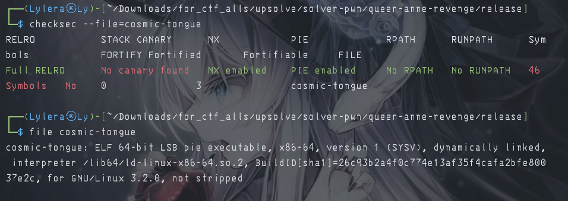
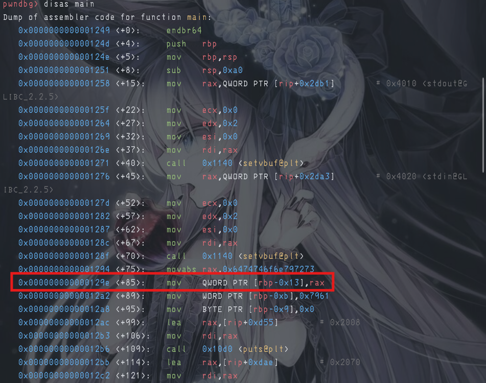
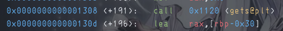

# 『cosmic-tongue』

Because this event was ended so i try to solve local. 

- [chall](./source/chall)

# 『The challenge』

There is source code and the binary files too, lets take a look:

```c
#include <stdio.h>
#include <string.h>

int main()
{
    setvbuf(stdout, NULL, _IONBF, 0);
    setvbuf(stdin, NULL, _IONBF, 0);

    char key[11] = "srynottday";
    char message[20];

    printf("Interstellar bounty hunters have scorched all but this land. And they are marching from the horizon.\n");
    printf("Countless warlocks have fought, yet none prevails against Captain Necron.\n");
    printf("All hope now rests upon thy lips, for thou art the Supernova Sorcerer, whose words alone can tear open the very fabric of this reality!\n");
    printf("Cast thy incantation, mighty one: ");
    fflush(stdout);

    gets(message);
    if (strcmp(message, "opensesame") == 0)
    {
        printf("With a thunderous groan, a secret passage of ancient make hath conjured before thou!\n");
        printf("A portal of golden light opens, beckoning the citizens to flee Captain Necron and his void-born scourges.\n");
        printf("Inside, thou hath found a parchment from the legendary King Midas:\n");
        printf("\"The golden treasure you're looking for is deep inside this land's mantle. Unearth it, and you shall receive victory.\"\n");
    }
    else if (strcmp(key, "opensesame") == 0)
    {
        printf("By your word, the very bedrock doth tremble! Thou hast ripped a fissure in this plane of existence!\n");
        printf("The land opens its mouth and swallows each and every hunters but one.\n");
        printf("For Captain Necron, a special fate: the earth itself doth erupt in a geyser of molten power, a tomb prepared for his very soul.\n");
        printf("The infernal geyser spits out remnants of him, with mystic inscriptions written upon its charred bones:\n");
        FILE *file = fopen("flag.txt", "r");
        if (file == NULL)
        {
            printf("Error opening flag.txt\n");
            return;
        }
        char flag[100];
        fgets(flag, sizeof(flag), file);
        printf("%s\n", flag);
        fclose(file);
    }
    else
    {
        printf("Thy mouth of wisdom hath spoken words of cosmic import: %s\n", message);
        printf("Verily, a phrase of such sorcery hath never been uttered!\n");
        printf("Dreaded Captain Necron flees from the scene.. biding his time until thy final hour to return and lay waste to this land!\n");
    }

    return 0;
}
```

and the security of this file:



i forgot to check security for make this writeup. So this is buffer overflow, lets solve

# 『Highlight vulnerability and parts of interesting』

So here are are the interesting part of this challenge

```c
else if (strcmp(key, "opensesame") == 0)
    {
        ...
```

and the vuln to confirming it:

```c
    char key[11] = "srynottday";
    char message[20];

    printf("Interstellar bounty hunters have scorched all but this land. And they are marching from the horizon.\n");
    printf("Countless warlocks have fought, yet none prevails against Captain Necron.\n");
    printf("All hope now rests upon thy lips, for thou art the Supernova Sorcerer, whose words alone can tear open the very fabric of this reality!\n");
    printf("Cast thy incantation, mighty one: ");
    fflush(stdout);

    gets(message);
```

that this is buffer overflow vulnerability. But how many the offset of this? lets decompile it



So this is the first clue where key is hardcode. The rbp-0x13 giving us the offset of the first one which mean the hardcoded of the key.



and the second one, this is you can set buffer up until 0x30. By combining this one the rbp to overwrite is equal 0x1d

Also in the code, we need the key of "opensesame" -> 10 bytes. 

# 『Solving Challenge』 and 『Flag』
> solve by Lylera

After knowing how much offset we need, we can do buffer up until 29 then adding "opensesame" to give the password for getting flag.

Manual:


Script:

[solver.py](./source/solver.py)

the result:


# 『other』

- [chall](./source/chall)
- [solver.py](./source/solver.py)