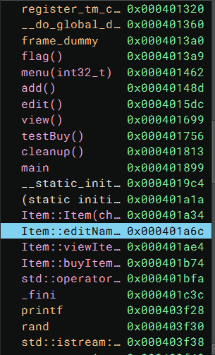
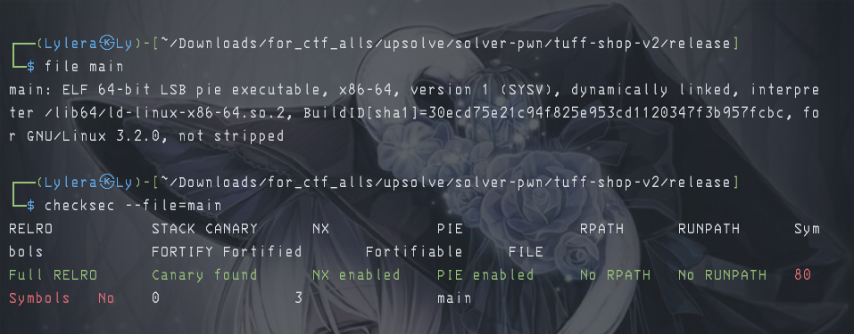
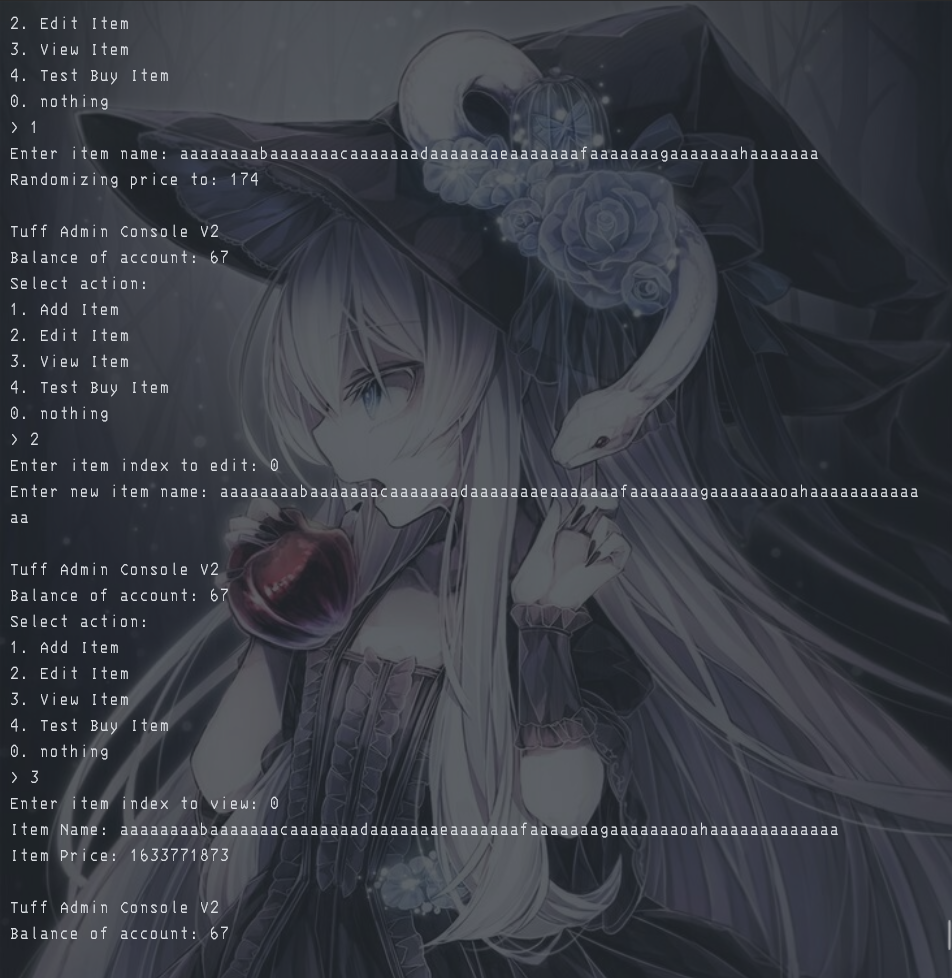
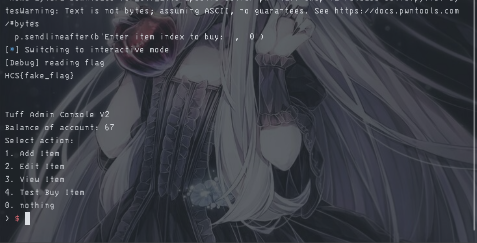

# 『tuff-shop』

Because this event was ended so i try to solve local. 

- [main](./source/main)

# 『The challenge』

No source code, only compiler file. so lets decompile and checkfile.

# 『Highlight vulnerability and parts of interesting』

So here are are the interesting part of this challenge



Pretty mess for this option. 
There are plenty of choice on this one, lets decompile. The result:

```asm
0040148d    int64_t add() #add new product and price based is random

0040149a        void* fsbase
0040149a        int64_t rax = *(fsbase + 0x28)
004014ba        int32_t i
004014ba        
004014ba        for (i = 0; i s<= 9; i += 1)
004014d7            if (*((sx.q(i) << 3) + &items) == 0)
004014d7                break
004014d7        
004014dd        if (i != 0xa)
00401507            std::operator<<<std::char_traits<char> >(__out: &std::cout, 
00401507                __s: "Enter item name: ")
0040151d            void var_78
0040151d            std::operator>><char>(var_78, &std::cin)
00401522            char var_29_1 = 0
00401526            int32_t rax_5 = rand()
00401586            std::ostream::operator<<(
00401586                this: std::ostream::operator<<(
00401586                    this: std::operator<<<std::char_traits<char> >(__out: &std::cout, 
00401586                        __s: "Randomizing price to: "), 
00401586                    __n: rax_5 s% 0x64 + 0x64), 
00401586                __pf: std::endl<char>)
00401590            char* rax_11 = operator new(sz: 0x44)
004015a5            void var_68
004015a5            Item::Item(rax_11, &var_68)
004015be            *((sx.q(i) << 3) + &items) = rax_11
004014dd        else
004014e9            puts(str: "Inventory full")
004014e9        
004015cf        if (rax == *(fsbase + 0x28))
004015db            return rax - *(fsbase + 0x28)
004015db        
004015d1        __stack_chk_fail()
004015d1        noreturn


004015dc    int64_t edit() # editing name product after you added based index

004015e8        void* fsbase
004015e8        int64_t rax = *(fsbase + 0x28)
0040160b        std::operator<<<std::char_traits<char> >(__out: &std::cout, 
0040160b            __s: "Enter item index to edit: ")
00401621        int32_t __n
00401621        std::istream::operator>>(this: &std::cin, &__n)
00401621        
00401650        if (__n s< 0 || __n s> 9 || *((sx.q(__n) << 3) + &items) == 0)
0040165c            puts(str: "Invalid item index")
00401650        else
00401677            *((sx.q(__n) << 3) + &items)
0040167e            Item::editName()
0040167e        
00401690        if (rax == *(fsbase + 0x28))
00401698            return rax - *(fsbase + 0x28)
00401698        
00401692        __stack_chk_fail()
00401692        noreturn


00401699    int64_t view() #view the price after you added or edit

004016a5        void* fsbase
004016a5        int64_t rax = *(fsbase + 0x28)
004016c8        std::operator<<<std::char_traits<char> >(__out: &std::cout, 
004016c8            __s: "Enter item index to view: ")
004016de        int32_t __n
004016de        std::istream::operator>>(this: &std::cin, &__n)
004016de        
0040170d        if (__n s< 0 || __n s> 9 || *((sx.q(__n) << 3) + &items) == 0)
00401719            puts(str: "Invalid item index")
0040170d        else
00401734            *((sx.q(__n) << 3) + &items)
0040173b            Item::viewItem()
0040173b        
0040174d        if (rax == *(fsbase + 0x28))
00401755            return rax - *(fsbase + 0x28)
00401755        
0040174f        __stack_chk_fail()
0040174f        noreturn


00401756    int64_t testBuy() # for testing buying

00401762        void* fsbase
00401762        int64_t rax = *(fsbase + 0x28)
00401785        std::operator<<<std::char_traits<char> >(__out: &std::cout, 
00401785            __s: "Enter item index to buy: ")
0040179b        int32_t __n
0040179b        std::istream::operator>>(this: &std::cin, &__n)
0040179b        
004017ca        if (__n s< 0 || __n s> 9 || *((sx.q(__n) << 3) + &items) == 0)
004017d6            puts(str: "Invalid item index")
004017ca        else
004017f1            *((sx.q(__n) << 3) + &items)
004017f8            Item::buyItem()
004017f8        
0040180a        if (rax == *(fsbase + 0x28))
00401812            return rax - *(fsbase + 0x28)
00401812        
0040180c        __stack_chk_fail()
0040180c        noreturn
```

and the security of this file:



So this is logic shop vulnerability and heap overflow. It will change the price based on name price on it. For example:



# 『Solving Challenge』 and 『Flag』
> solve by Lylera

after know this vulnerability is heap overflow **AND** canary is on, so we can't do heap overflow. It just heap overflow by using null bytes for change the price

Script:

[solver.py](./source/solver.py)

the result:



# 『other』

- [chall](./source/main)
- [solver.py](./source/solver.py)