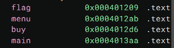
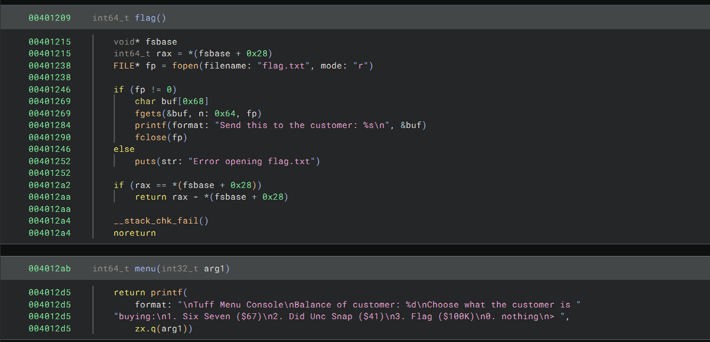
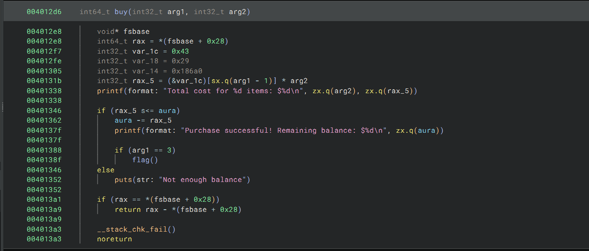
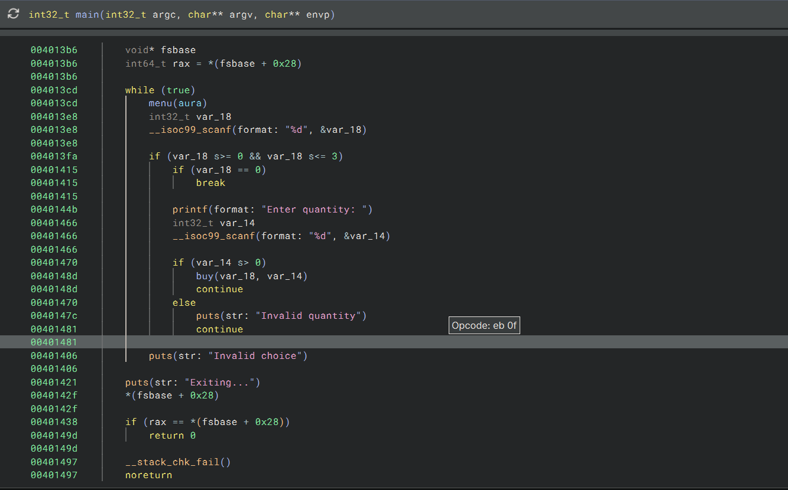
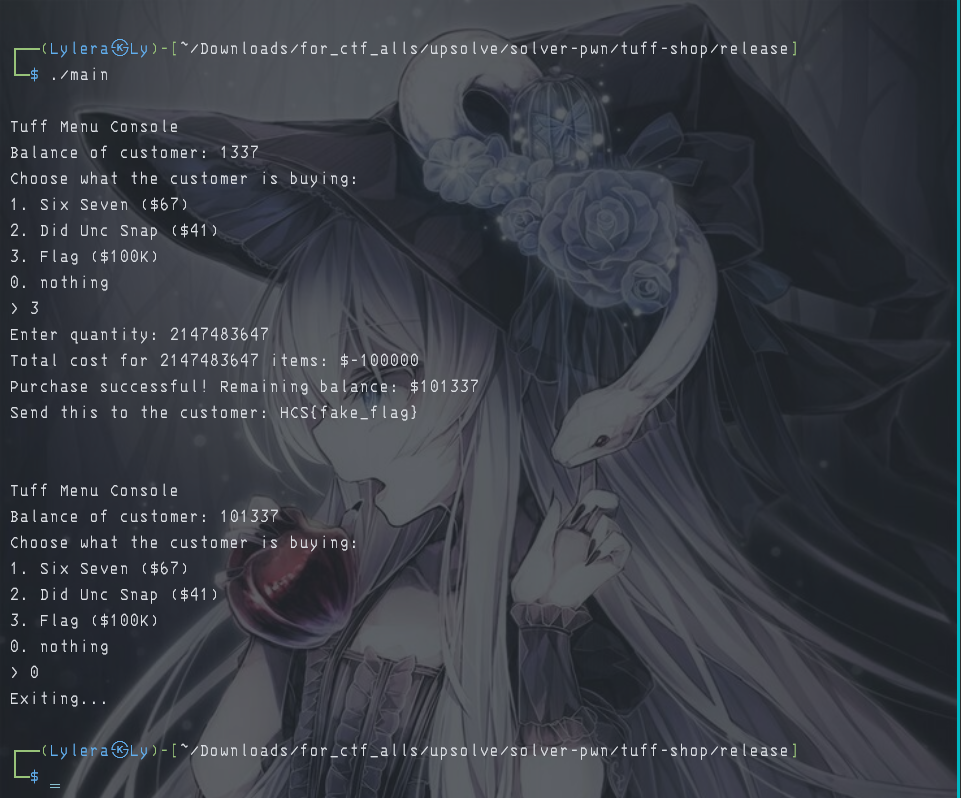
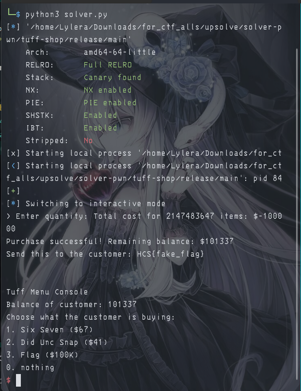

# 『tuff-shop』

Because this event was ended so i try to solve local. 

- [main](./source/main)

# 『The challenge』

No source code, only compiler file. so lets decompile and checkfile.

# 『Highlight vulnerability and parts of interesting』

So here are are the interesting part of this challenge



There are plenty of choice on this one, lets decompile. The result:







and the security of this file:


So this is logic shop vulnerability. It will detect if the input <= 0 and make the error to `invalid the quantity`. Here are the assembly of the code:

```asm

00401470                if (var_14 s> 0)
0040148d                    buy(var_18, var_14)
0040148d                    continue
00401470                else
0040147c                    puts(str: "Invalid quantity")
00401481                    continue

```

And the vuln itself: 

```asm
0040144b                printf(format: "Enter quantity: ")
00401466                int32_t var_14
00401466                __isoc99_scanf(format: "%d", &var_14)
```

which mean if we input the maximum of integer, the result will be `input` - `price of quantity`. How do we know the maximum of int? You can use this reference: https://learn.microsoft.com/en-us/cpp/c-language/cpp-integer-limits?view=msvc-170 

# 『Solving Challenge』 and 『Flag』
> solve by Lylera

after we know the vuln of this logic shop, we can solve this manual or script (depend which one you like).

Manual:



Script:

[solver.py](./source/solver.py)

the result:



# 『other』

- [chall](./source/main)
- [solver.py](./source/solver.py)
- [Documentation max int](https://learn.microsoft.com/en-us/cpp/c-language/cpp-integer-limits?view=msvc-170)