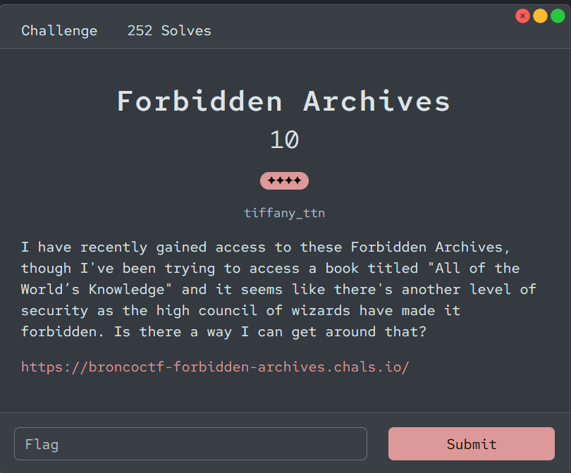
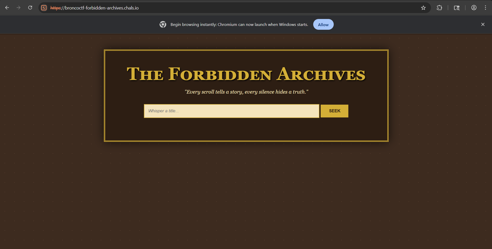
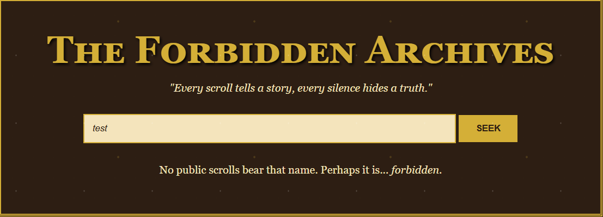
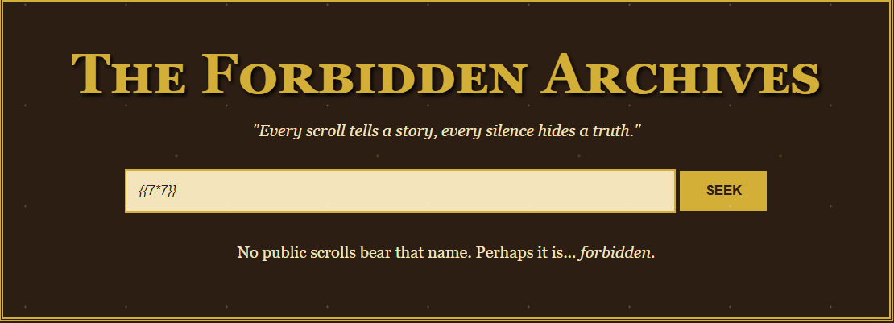
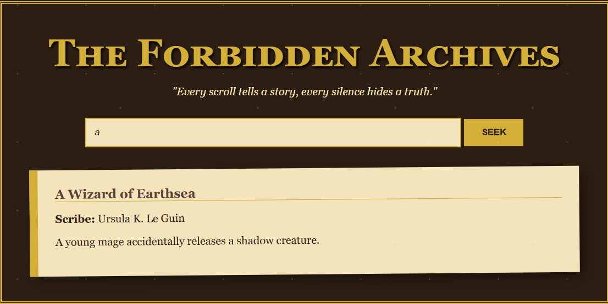
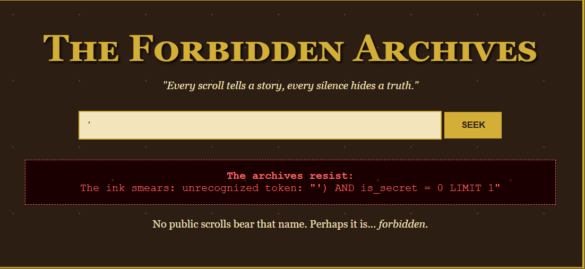
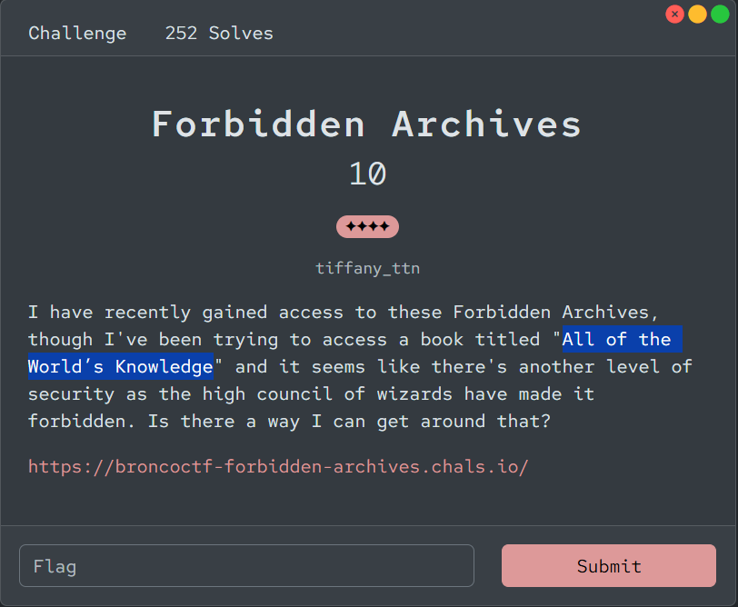
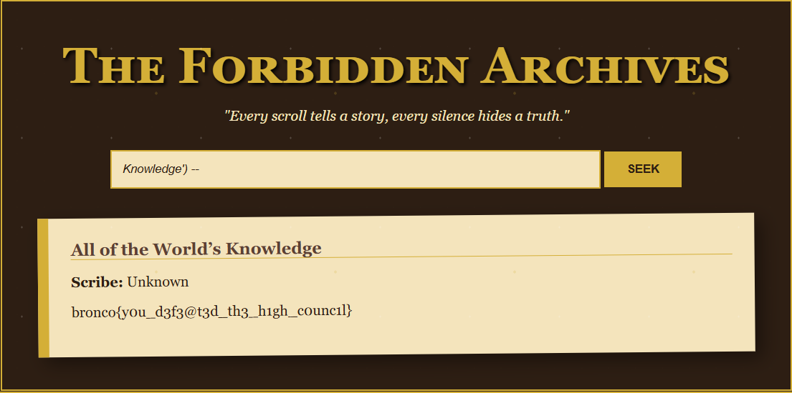

# 『Forbidden Archives』



# 『The challenge』



This is challs blind, so let solve it

# 『Highlight vulnerability and parts of interesting』

This is blind challs. As you can see, there are no source code anymore from folder source code, only the html one. So how to solve it

First lets do some test:



Perhaps nothing show anything. On my first though is ssti. Then i try to validate again:



Nothing show the result of 7*7 tho. And then i try type `a`. The result:



# 『Solving Challenge』
> solve by Lylera

After that know this is sql query, i try to testing using this one: `'`, the result should be like this:



The error shows this one. Why we needed? because this one is searching the book we want. Once we type something, for ex:

`a`

the result show based on the strings that we needed. This is occur due to searching like this:

`SELECT * FROM archives WHERE name = '$input'`.

The error shows "unrecognized token" which is show using sqlite (check this overflow: [sqlite_problems](https://stackoverflow.com/questions/57017469/solving-unrecognized-token-error-while-using-sqlite-insert-command))

Also the error show 'AND is_secret = 0 LIMIT 1' tells us that some secret book (which is flag ofcourse) setting the `is_secret` become 0 and limitting to 1. The secret it self is shown up on description challs:



which is we can do something like `') AND is_secret = 1 -- -` to make the other commented. Or you can do like this: `knowledge') --` too. 



# 『Flag』

```
bronco{y0u_d3f3@t3d_th3_h1gh_c0unc1l}
```

## 『Source code』

- [index.html](./source_code/index.html)