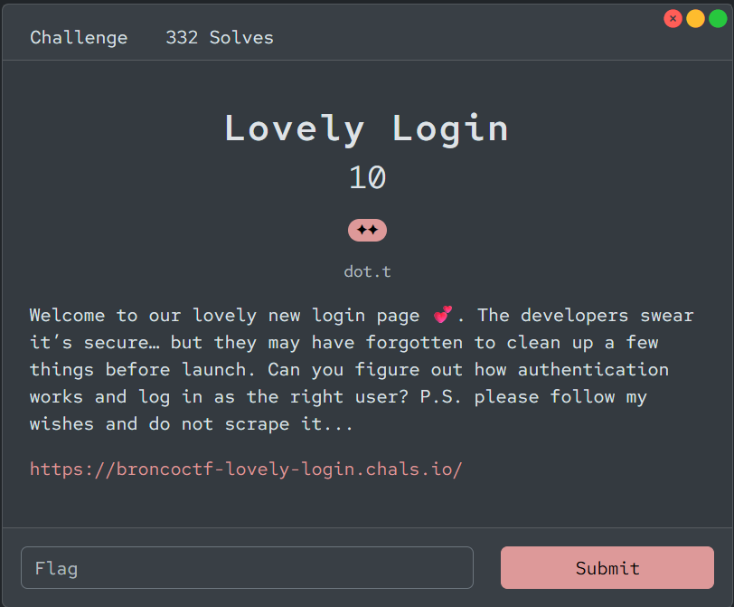
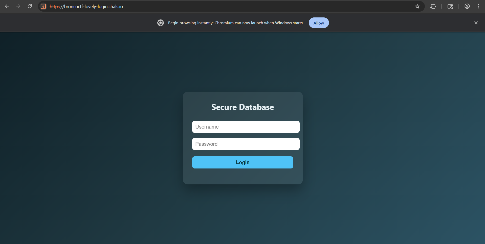
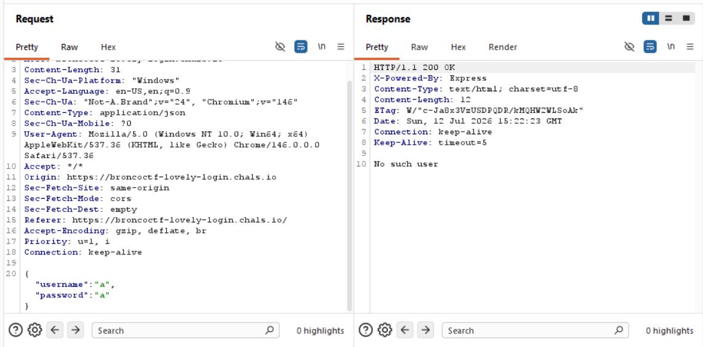
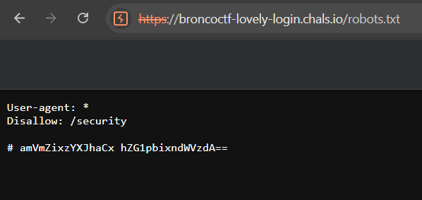
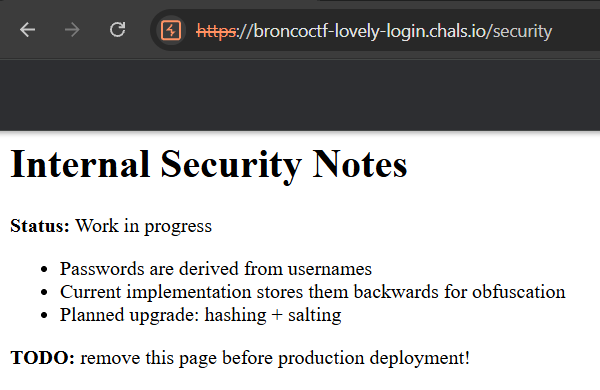
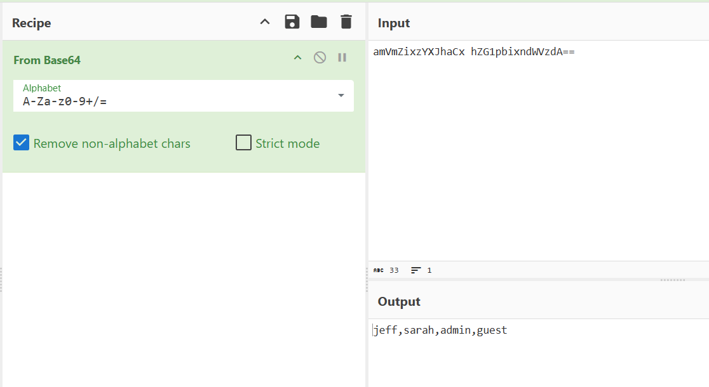
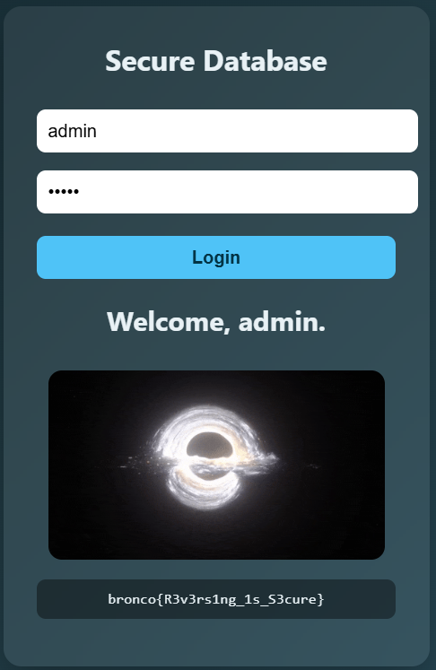

# 『Lovely Login』



# 『The challenge』



This is challs blind, again. So let solve it

# 『Highlight vulnerability and parts of interesting』

Because this is blind, lets test first 



# 『Solving Challenge』
> solve by Lylera

Perhaps nothing show anything. So, lets do some crawling: robots.txt



There is b64 encode and some path to `/security`



Well there is clue. The password is reverse of the word. For example if i type: `Yui`, we try to reverse it from that word it goes like this: `iuy`. Here are the result of decode:



After knowing this one, we can admin login with the pw: nimda



# 『Flag』

```
bronco{R3v3rs1ng_1s_S3cure}
```

## 『Source code』

- [index.html](./source_code/index.html)
- [robots.txt](./source_code/robots.txt)
- [security.html](./source_code/security.html)