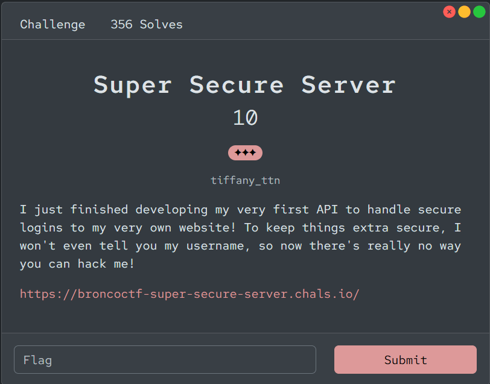
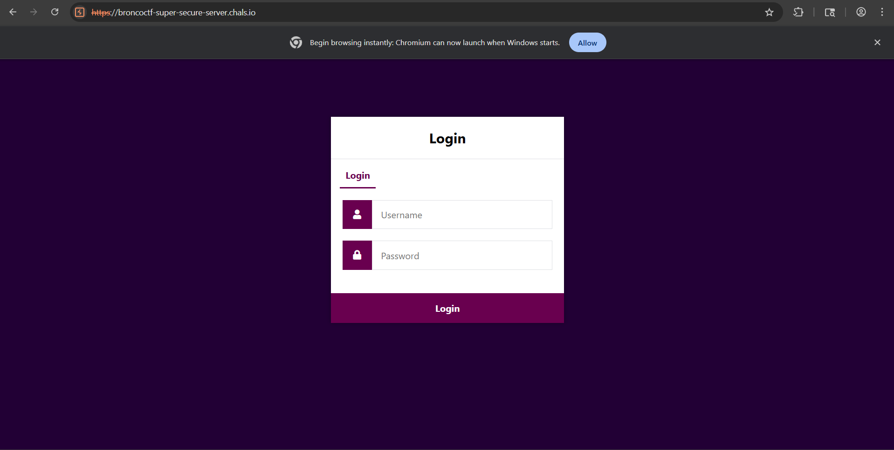
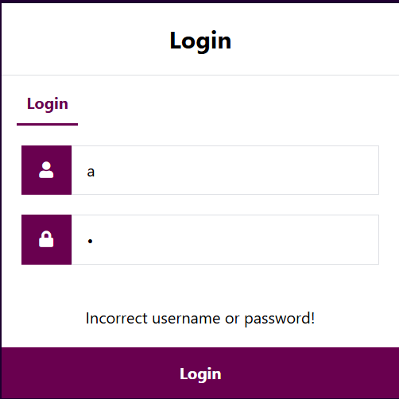
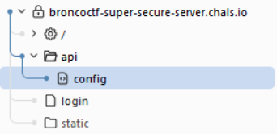
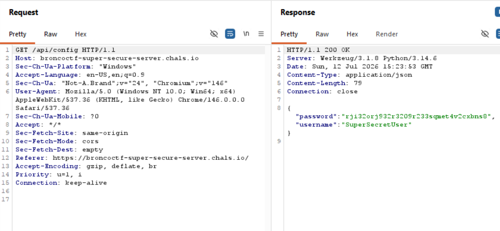
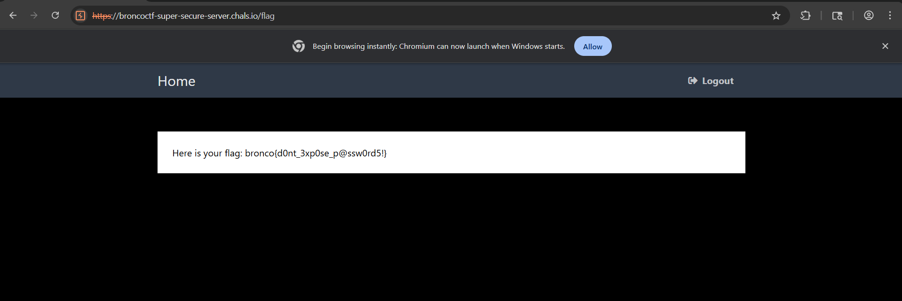

# 『Super Secure Server』



# 『The challenge』



This is challs blind, again. So let solve it

# 『Highlight vulnerability and parts of interesting』

Because this is blind, lets test first 



# 『Solving Challenge』
> solve by Lylera

Perhaps nothing show anything. How about we check using burpsuite?



There is leak on api, let see what is it.



Well there is password and the user. It is due to api/config has been leak for some reason on backend and giving free credential, so lets use it



# 『Flag』

```
bronco{d0nt_3xp0se_p@ssw0rd5!}
```

## 『Source code』

- [index.html](./source_code/index.html)
- [api/config](./source_code/api/config.txt)
- [style](./source_code/static/style.css)
- [flag](./source_code/flag.html)