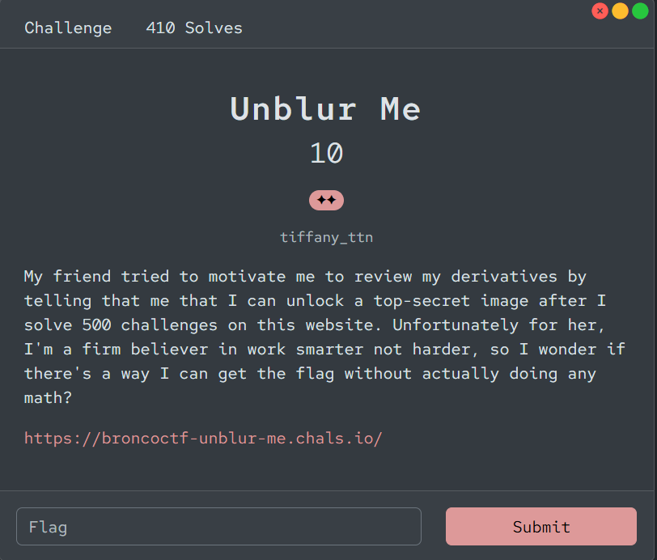
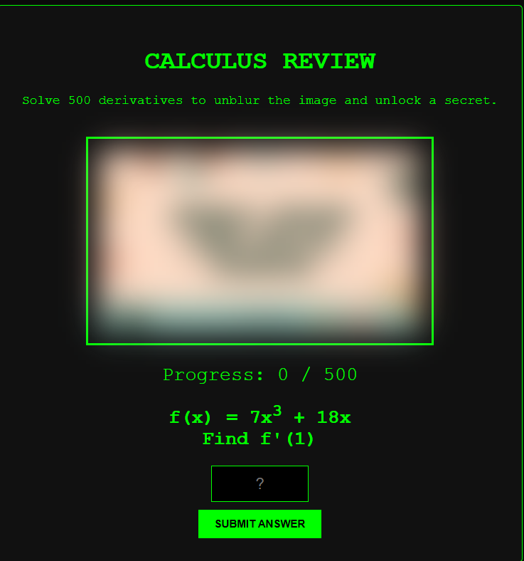
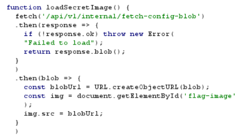
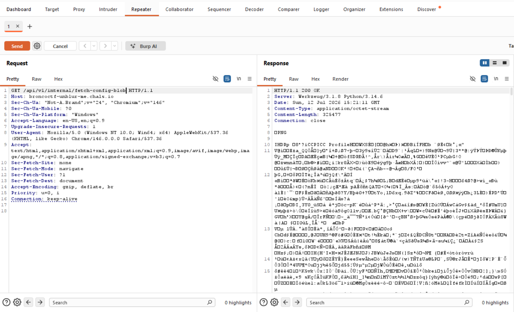
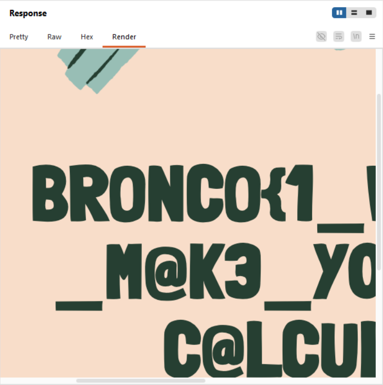
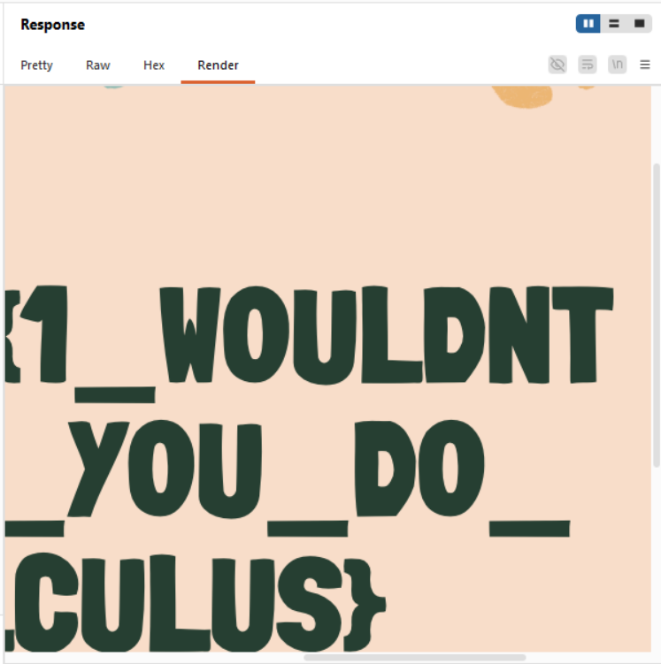
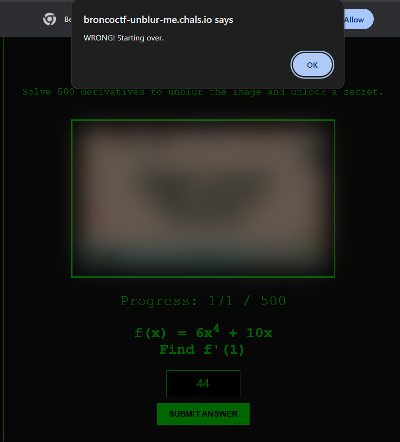

# 『Unblur me』



# 『The challenge』



This is challs blind, again. So let solve it

# 『Highlight vulnerability and parts of interesting』

Interesting challs tho, so lets solve it

# 『Solving Challenge』
> solve by Lylera

Lets use burpsuite and you see there is some leak api for the image.



Well quick explanation about fetch. Fetch is the function on js that connect it to another link for supporting your whatever you want (for ex in this challs is image). For the documentation, you can read on this one: [fetch](https://developer.mozilla.org/en-US/docs/Web/API/Fetch_API/Using_Fetch). It make the request to connect it to your html. But could we connect to that link? the answer:



Yes, you can connect it to that link. If you use burpsuite, you will connect to that link and giving the inside information about that link. How about we direct connect to that link? well you can do it and gain that file which is type of the file: png. Flag:





There is intended solution of this challs, like this:

```
Intended Solution:
There are several appraoches to solve this challenge:

The user can modify the css to immediately unblur the image by going to Inspect Element, looking under the Elements tab, and updating flag-image's filter to remove the blur.
After looking through the website's code, the user can run correctCount = 500; in the console before solving 1 problem to activate checkAnswer() and pass the criteria needed to get the unblurred image.
The user can directly view the unblurred image when server sends the image over by looking under the Network tab, selecting the image blob returned, and looking at the image preview.

```

Well you can use inspect element to solve it with unblurring it from above information.

# 『Flag』

```
bronco{1_WOULDNT_M@K3_YOU_DO_C@LCULUS}
```

# 『Funfact』

On this challenge, i enjoy to solve it. So here it is:



i did calculus quickly and make typo xD

## 『Source code』

- [index.html](./source_code/index.html)