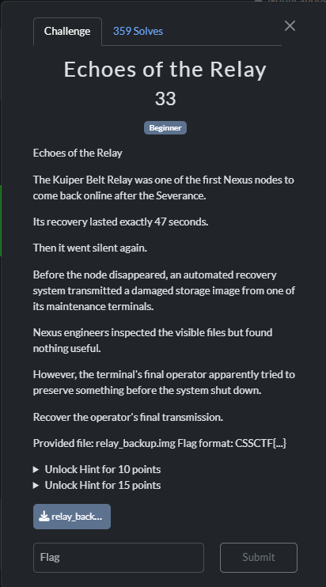
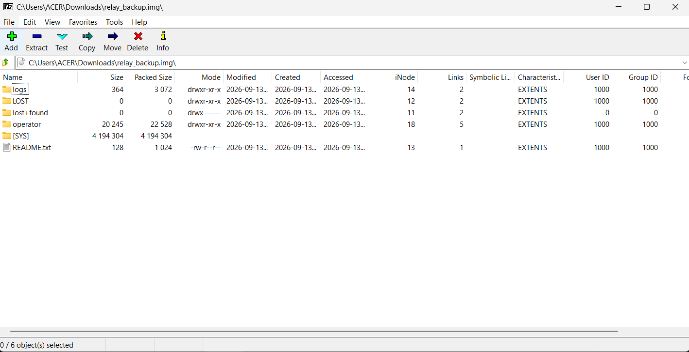
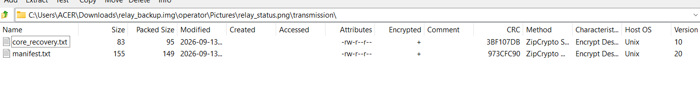
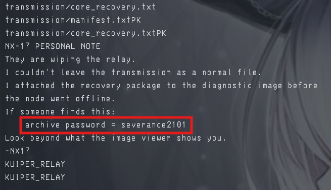
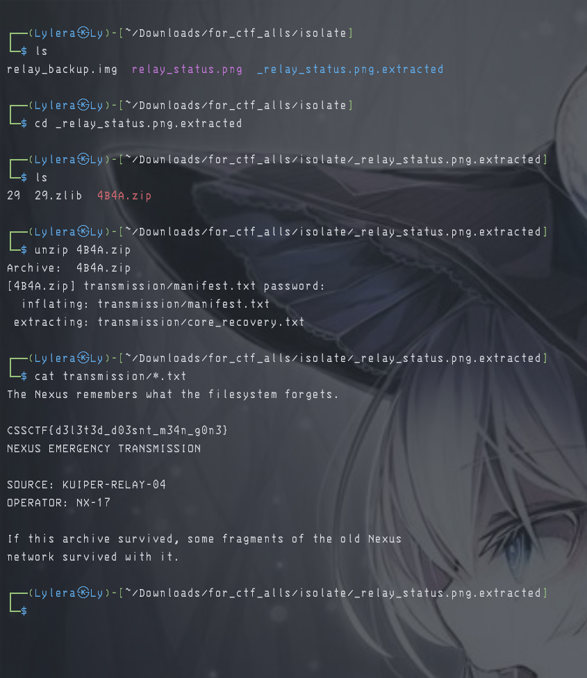

# 『Echoes of Relay』



# 『The challenge』

[Challenge - disk image](./src/relay_backup.img)

## 『Highlight vulnerability and parts of interesting』

This is my first time solving disk image challs. It is beginner of course so i learn a lot in here

## 『Solving Challenge』
> solve by Lylera

To open this, i use `7zip` on disk image and show this one



I try to extract it and before i close, i look any file in here turns out there is image and there is file inside of it (zip of course). The result:



So i use my linux and use `binwalk` to pull out the files. The zip was lock so i went back through disk image to see if there is anything fun. But tbh this one unexpected, i use `strings` and there is password to the zip



And then i go to the extract files, unzip and use password that they give it to me. After that i use `cat transmission/*.txt` and here the result



### 『Flag』

```
CSSCTF{d3l3t3d_d03snt_m34n_g0n3}
```

### 『Reference』

- https://www.kphonline.co.uk/2011/08/reading-raw-disk-images-with-7zip/ (my reference)