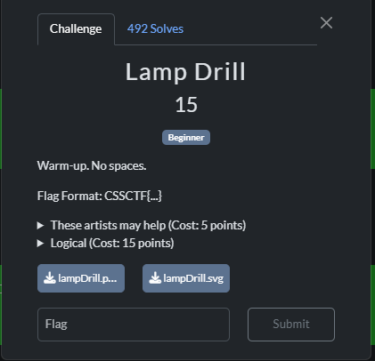
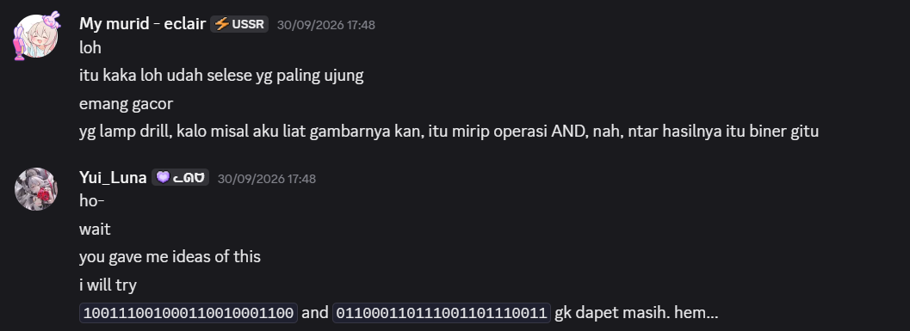
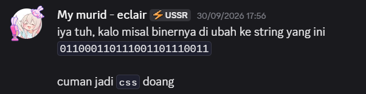
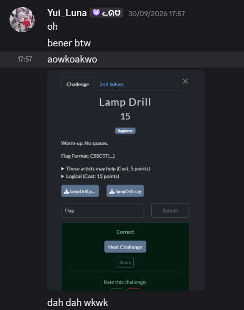

# 『Lamp Drill』



# 『The challenge』


So only play binary tho

## 『Highlight vulnerability and parts of interesting』

Because only play logical gate, we can asume that 1 + 1 = 1, 1 + 0 = 0, 0 + 1 = 1, and 0 + 0 = 0

## 『Solving Challenge』
> solve by Lylera

Black = 1 and white = 0. So how to solve it. Just follow the track and you got something like 
i discuss with my team (eclair) to solve this one. 



`CSSCTF{011000110111001101110011}`

still not solve. And then he gave me idea on second time to decode it -> css



result:




### 『Flag』

```
CSSCTF{css}
```

### 『Reference』

- [AND gate logical](https://www.electronics-tutorials.ws/logic/logic_2.html) (pretty easy cuz i learn this too)