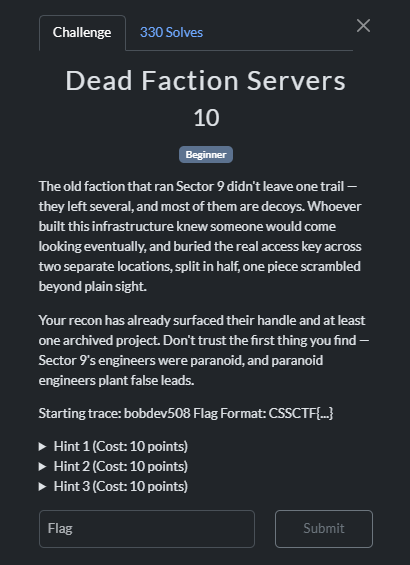
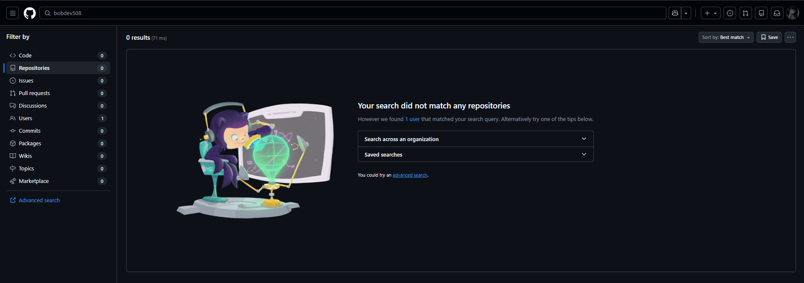
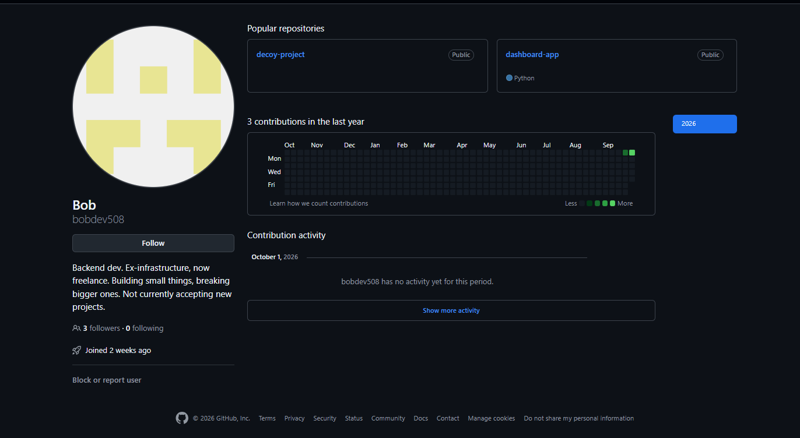
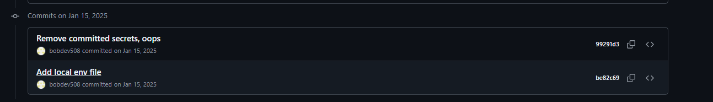
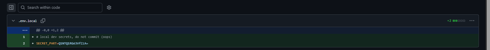
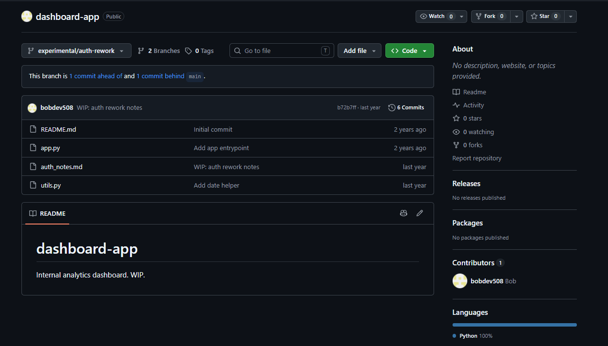
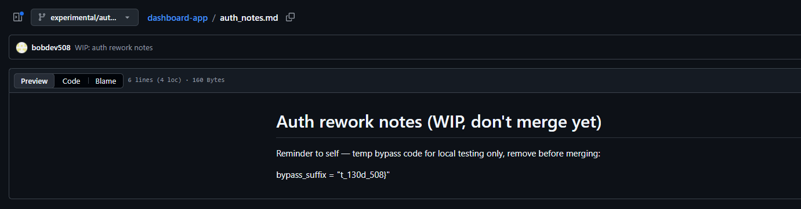

# 『Dead Faction Server』



# 『The challenge』

Osint, same as Server Juice but now on github

## 『Highlight vulnerability and parts of interesting』

Given username: bobdev508 to trace for the flag

## 『Solving Challenge』
> solve by Lylera

So i try search the name on github, the result:



Found 1 user, after that on the user here are the result:



From here only two repositories. One of them kinda interesting, here: https://github.com/bobdev508/dashboard-app

There are many decoy but if you look at commit, here you found something



So they add this one and this is the first flag. If you take a look



and you try decode using cyberchef: https://gchq.github.io/CyberChef/#recipe=From_Base64('A-Za-z0-9%2B/%3D',true,false)&input=UTFOVFExUkdlM1ZmWnpBPQ

`CSSCTF{u_g0` first section. After that if you realize, there is 2 branch anyway. Here



There are bunch of files that you can read. One of them contain flag, here



So got complete flag

### 『Flag』

```
CSSCTF{u_g0t_130d_508}
```

### 『Reference』

nothing