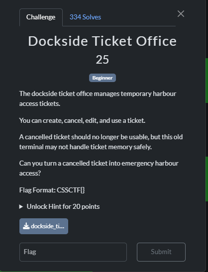
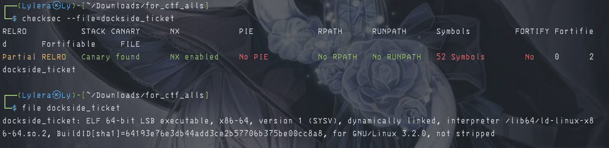
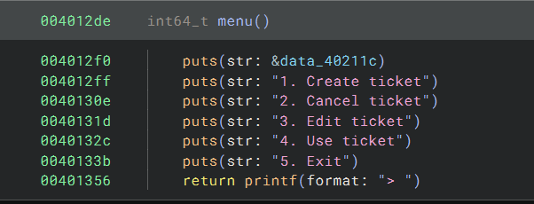
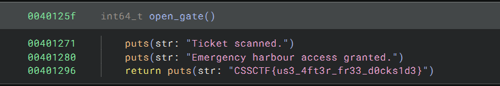

# 『Dockside Ticket Office』



# 『The challenge』



Pretty scary. Almost full protection also binary files: [click me](./src/dockside_ticket)

## 『Highlight vulnerability and parts of interesting』

I use my belove binary ninja to see the source code



## 『Solving Challenge』
> solve by Lylera

At first i thought it was heap until you see this one:



Maybe the probset didn't know how to make binary exploitation or maybe just for fun? idk

### 『Flag』

```
CSSCTF{us3_4ft3r_fr33_d0cks1d3}
```

### 『Reference』

nothing