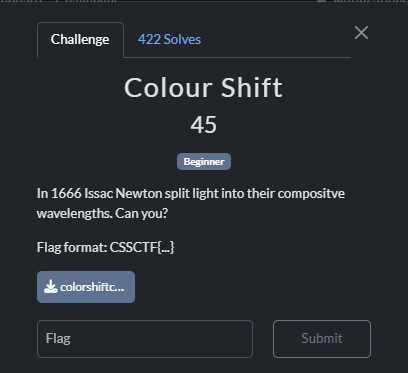
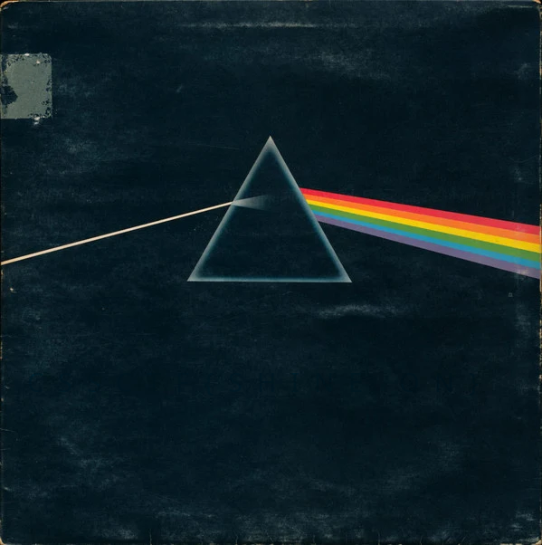
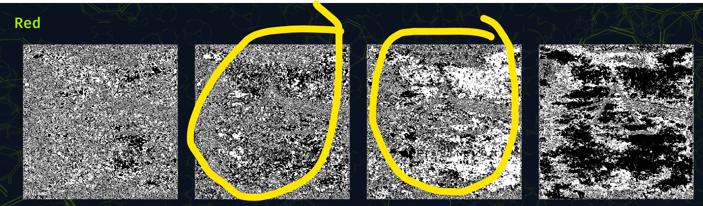
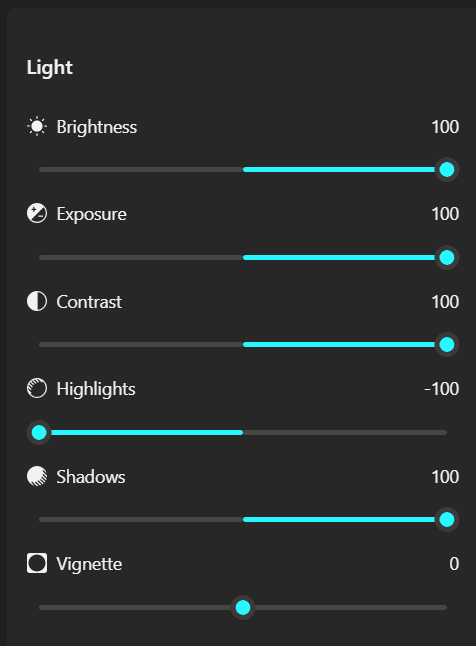
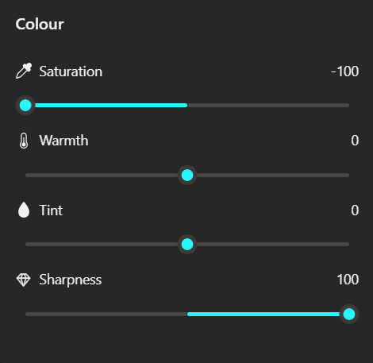
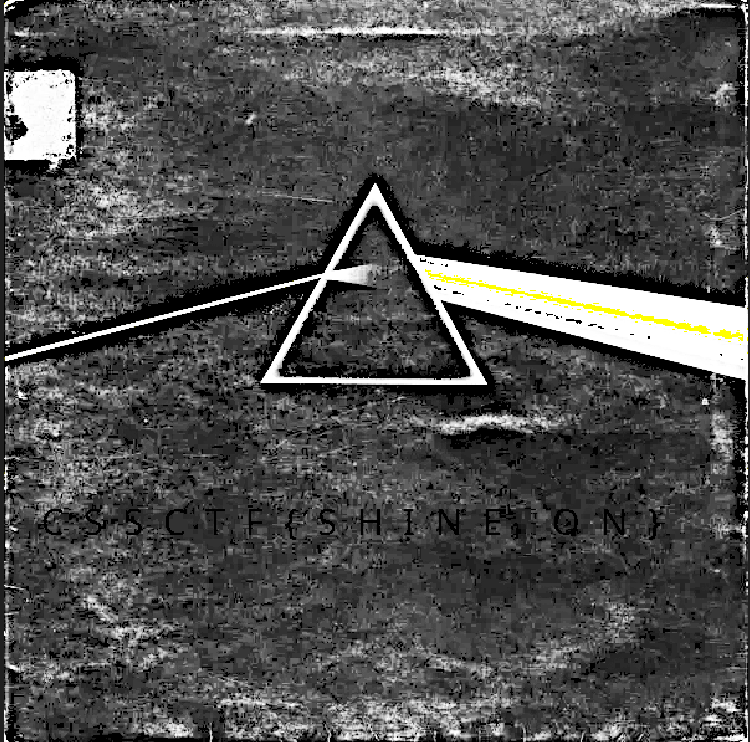

# 『Colour shift』



# 『The challenge』



Nothing interesting right? here are the challs: [colorshiftctf.cmp](./src/colorshiftctf.bmp) or you can take the image. It is same

## 『Highlight vulnerability and parts of interesting』

Haah-, stegano challs.

## 『Solving Challenge』
> solve by Lylera

First, change to png. Go to aperi solve to see what colour that can read the flag inside this image. 



As you can see, there is hidden flag so i went manual. Here are my settings:




The result:



### 『Flag』

```
CSSCTF{SHINEON}
```

### 『Reference』

- [aperi solve](https://www.aperisolve.com/) good for stegano