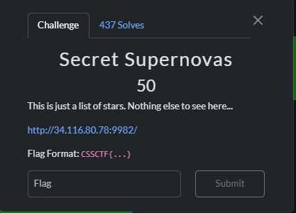
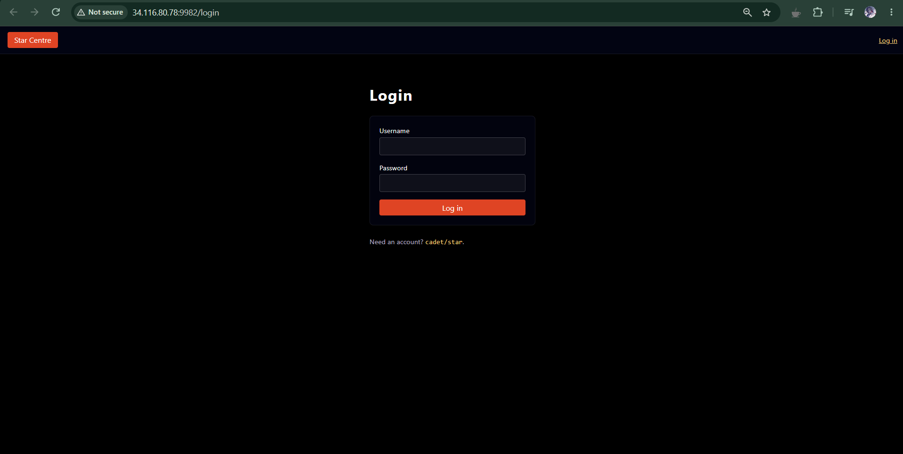
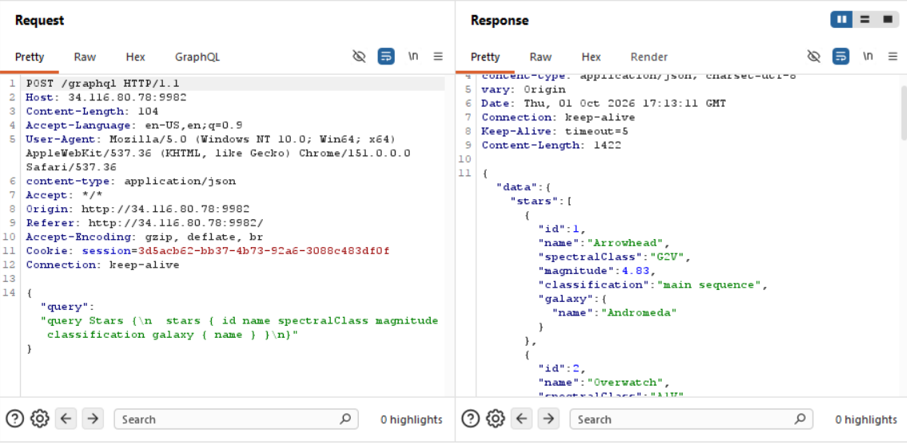
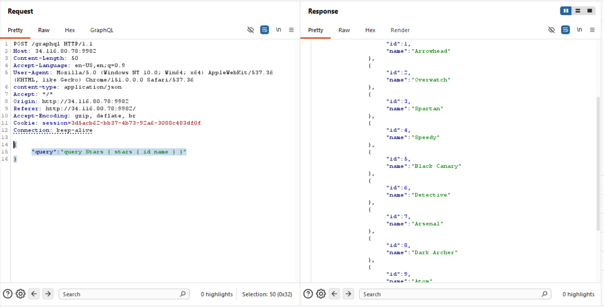
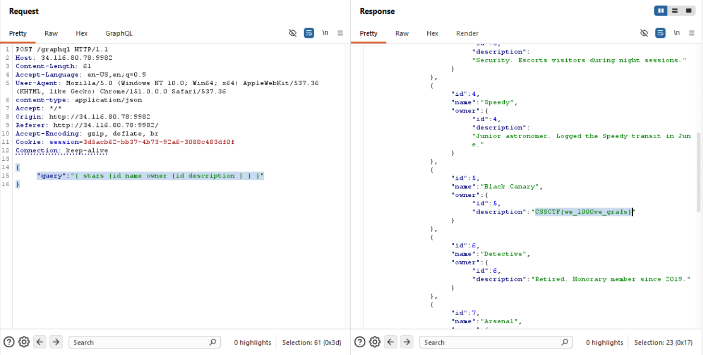

# 『Secret Supernovas』



# 『The challenge』



Blind...

## 『Highlight vulnerability and parts of interesting』

Because this is blind, you can use cred

`username: cadet`
`pw: star`

## 『Solving Challenge』
> solve by Lylera

After you login, there is nothing interesting right? here the result


But if you open burpsuite, there is endpoint that interest you.



So lets try to see the behaviour of this one. i use `{"query":"{__schema}"}` to check if this one vuln at graphql query or not and confirm this is vuln of query injection. So i use [almighty payload all the things](https://github.com/swisskyrepo/PayloadsAllTheThings/tree/master/GraphQL%20Injection) to help me. My second payload: 
```
{
"query": "query Stars { stars { id name } }"
}
```

and the result:



It mean we query the stars as id name of the stars itself. But how to find flag after like this? So you can use simple query injection like this

```sql
{
"query": "{ stars {id name owner {id description } } }"
}
```



### 『Flag』

```
CSSCTF{we_l000ve_grafs}
```

### 『Reference』

- [graphql injection](https://github.com/swisskyrepo/PayloadsAllTheThings/tree/master/GraphQL%20Injection)
