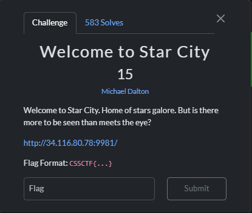
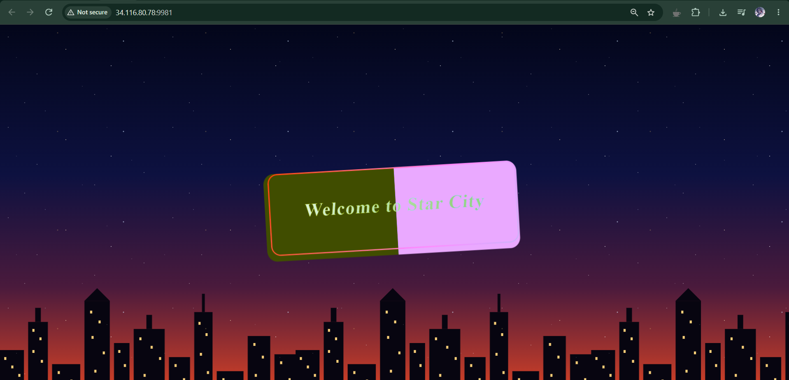
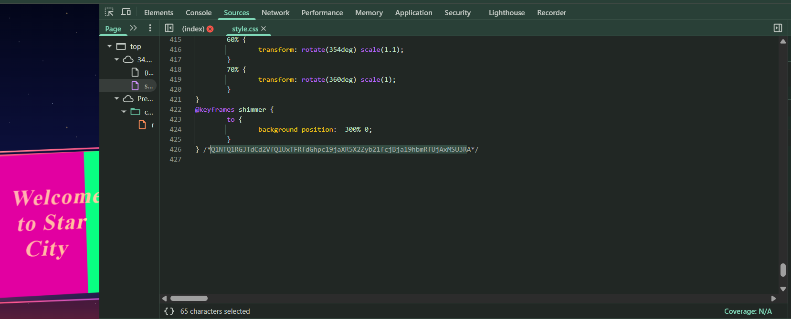

# 『Welcome to Star City』



# 『The challenge』



Only static website

## 『Highlight vulnerability and parts of interesting』

So... how to solve it? nothing interest and no endpoint?

## 『Solving Challenge』
> solve by Lylera

You can inspect element by right click > inspect. And then you can choose `sources`. Then choose style.css, scroll it down until you find this



After that you can go through cyberchef and decode using base 64.

https://gchq.github.io/CyberChef/#recipe=From_Base64('A-Za-z0-9%2B/%3D',true,false)&input=UTFOVFExUkdKVGRDZDJWZlFsVXhURlJmZEdocGMxOWphWFI1WDJaeWIyMWZjakJqYTE5aGJtUmZVakF4TVNVM1I
### 『Flag』

```
CSSCTF{Bwe_BU1LT_this_city_from_r0ck_and_R011}
```

### 『Reference』

- [pico - inspect html](https://learn.cylabacademy.org/library/275?page=1&category=1) The basic of inspect