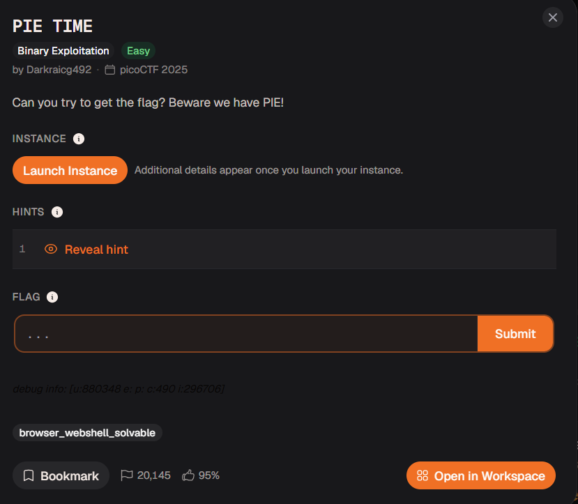
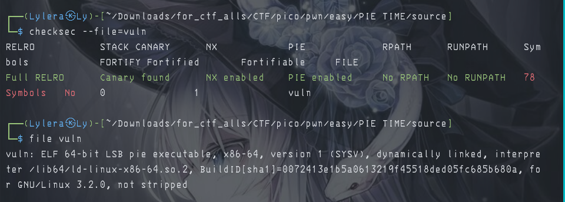
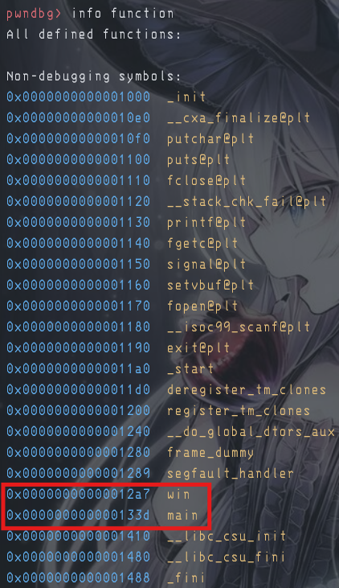
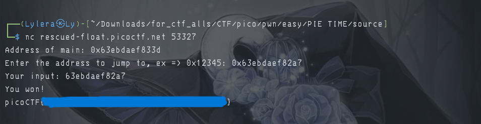
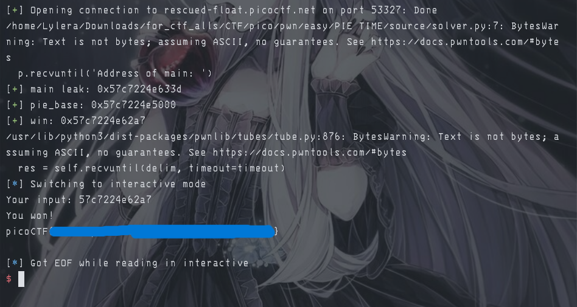

# 『PIE TIME』



# 『The challenge』

Second challenge easy i solve (to speedrun). About Pie, lets solve

# 『Highlight vulnerability and parts of interesting』

here is part of the source code c

```c
#include <stdio.h>
#include <stdlib.h>
#include <signal.h>
#include <unistd.h>

void segfault_handler() {
  printf("Segfault Occurred, incorrect address.\n");
  exit(0);
}

int win() {
  FILE *fptr;
  char c;

  printf("You won!\n");
  // Open file
  fptr = fopen("flag.txt", "r");
  if (fptr == NULL)
  {
      printf("Cannot open file.\n");
      exit(0);
  }

  // Read contents from file
  c = fgetc(fptr);
  while (c != EOF)
  {
      printf ("%c", c);
      c = fgetc(fptr);
  }

  printf("\n");
  fclose(fptr);
}

int main() {
  signal(SIGSEGV, segfault_handler);
  setvbuf(stdout, NULL, _IONBF, 0); // _IONBF = Unbuffered

  printf("Address of main: %p\n", &main);

  unsigned long val;
  printf("Enter the address to jump to, ex => 0x12345: ");
  scanf("%lx", &val);
  printf("Your input: %lx\n", val);

  void (*foo)(void) = (void (*)())val;
  foo();
}
```

This asking of the memory to jump it. But there is a pie, so you must get the offset first and how much. Here are the information needed:



# 『Solving Challenge』
> solve by Lylera

[answer](./assets)

what's pie? according to this explanation (one of my favorite explanation): [ir0nstone - pie](https://ir0nstone.gitbook.io/notes/binexp/stack/pie) and from my knowledged based on my experience so PIE is a one of the security that make the memory randomize so make hard to exploit. But you can get rid of it by giving some bypass in here. According to  the source code, we getting leak of the main. Here:

```c
int main() {
  signal(SIGSEGV, segfault_handler);
  setvbuf(stdout, NULL, _IONBF, 0); // _IONBF = Unbuffered

  printf("Address of main: %p\n", &main); //this would print the memory main address -> format string attack actually
```

Also we will been given the binary file (that has been compile of course), so here: 


Full green and pie is enabled (same the title). So by giving this information, you must know where is 3 digit last number. I use pwndbg to make it easier (and of course, you can use gdb if you lazy to download pwndbg):



and if you try to calculate it, you can do like this:

```asm
pwndbg> p/x 0x133d - 0x12a7
$1 = 0x96
```
# 『Flag』

the result is 0x96. and of course three digit last number is static, so you can do exact this one (except... the file that has been given to us and the remote is different :> ). So you can do 2 solve, manual or script.

manual:



script:

[solver.py](./source/solver.py)



But i would rather recommend try to learn the code cuz you'll never know in future where you play ctf and remote are different so so yeah

# 『other』

- [chall](./source/)
- [solver.py](./source/solver.py)
- [ir0nstone - pie](https://ir0nstone.gitbook.io/notes/binexp/stack/pie)