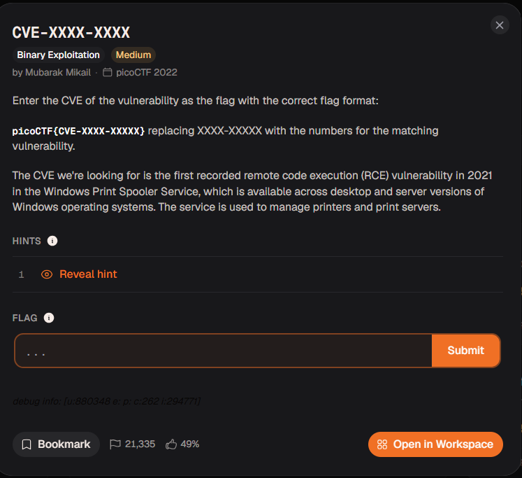

# 『CVE-XXXX-XXXX』



# 『The challenge』

No files and no binaries, only knowledge of zero days cve

## 『Highlight vulnerability and parts of interesting』

```
The CVE we're looking for is the first recorded remote code execution (RCE) vulnerability in 2021 in the Windows Print Spooler Service, which is available across desktop and server versions of Windows operating systems. The service is used to manage printers and print servers.
```

## 『Solving Challenge』
> solve by Lylera

well this is simple challenge actually but real world. This vuln is: https://nvd.nist.gov/vuln/detail/cve-2021-34527 (printnightmare). This is remote code execution that can CRUD only user rights. The exploit itself should be outdated (but there is potential to gain rce again). Therefore, you might get warn only this information to be more carefull at coding C/C++ tho (not only C/C++ but also all language programming like js, html, css, rust, go, etc)

RCE itself it can control the system whatever attacker want. So if you find rce, report it and if you are planning to developer and found this, patch it immediately.

### 『Flag』

the flag is the number of cve like: CVE-year-number


### 『other』

- [Printnightmare](https://nvd.nist.gov/vuln/detail/cve-2021-34527)