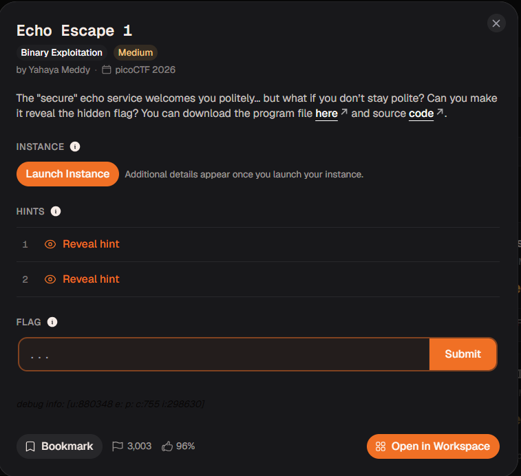
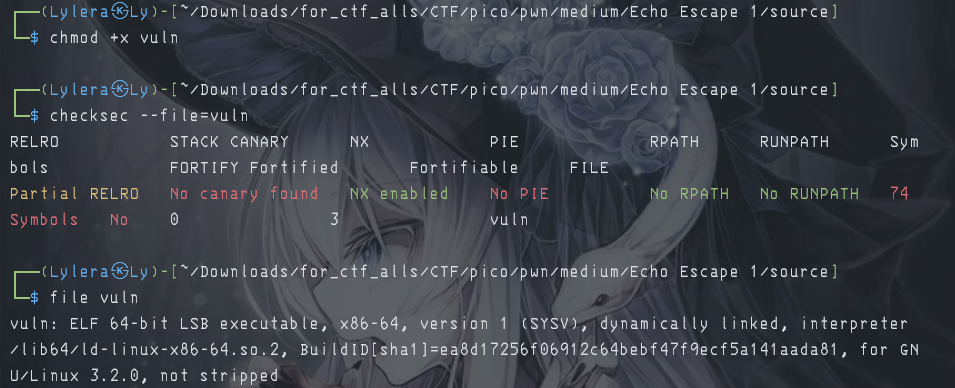
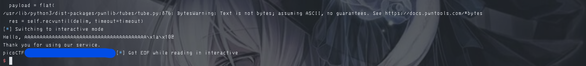

# 『Echo Escape 1』



# 『The challenge』

This challenge looks interesting and the security of this file is:



## 『Highlight vulnerability and parts of interesting』

source code:

```c

#include <stdio.h>
#include <unistd.h>
#include <string.h>

void win() {
    FILE *fp = fopen("flag.txt", "rb");
    if (!fp) {
        perror("[!] Failed to open flag.txt");
        return;
    }

    char buffer[128];
    size_t n = fread(buffer, 1, sizeof(buffer), fp);
    fwrite(buffer, 1, n, stdout);
    fflush(stdout);
    printf("\n");
    fclose(fp);
}

int main() {
    char buf[32]; 

    printf("Welcome to the secure echo service!\n");
    printf("Please enter your name: ");
    fflush(stdout);

    read(0, buf, 128);

    printf("Hello, %s\n", buf);
    printf("Thank you for using our service.\n");

    return 0;
}

```

This is buffer overflow and call win function to get flag. Very simple actually. Oh anyway you can read about this one:

- [cryptocat - github](https://github.com/Crypto-Cat/CTF/tree/main/pwn/binary_exploitation_101/03-return_to_win) and [video](https://youtu.be/E4ZWJsGySoY?si=VjZAe9yHzvuOZ8iB)
- [ir0stone - win](https://ir0nstone.gitbook.io/notes/binexp/stack/ret2win)
- [other explanation](https://github.com/max-b/ropemporium/blob/master/ret2win/README.md)

After all source i gave, you might understood just a little so here is explanation from me. So basically there is 2 function, main and win program. You can do whatever at main and type anything you like with the maximum space: 32 byte (that you can overflow it). And then you can't get win function. But how we can call win function tho? if you take a look on the `checksec --file=vuln` (this is the command to check the security of the files tho), there is no pie meaning that we can get static memory address tho and we can jump on it.

## 『Solving Challenge』
> solve by Lylera

So after knowing this one, you can make script for these one (but mainly this solve using script tho) so here is the script:

[solver.py](./source/solver.py)

You can read by yourself and understand it. Also i make 2 option, either you can make automatic search or just manual one. Two of these are fine as long you understand what it do.

### 『Flag』

the result:



### 『other』

- [chall](./source/)
- [solver.py](./source/solver.py)
- [cryptocat - github](https://github.com/Crypto-Cat/CTF/tree/main/pwn/binary_exploitation_101/03-return_to_win) and [video](https://youtu.be/E4ZWJsGySoY?si=VjZAe9yHzvuOZ8iB)
- [ir0stone - win](https://ir0nstone.gitbook.io/notes/binexp/stack/ret2win)
- [other explanation](https://github.com/max-b/ropemporium/blob/master/ret2win/README.md)
- [rop - ironst0ne](https://ir0nstone.gitbook.io/notes/binexp/stack/return-oriented-programming) (i gave this one to read it about rop, so enjoy)