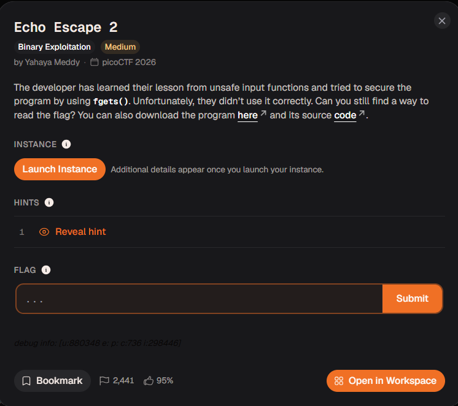
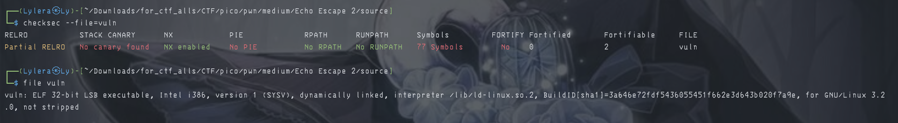
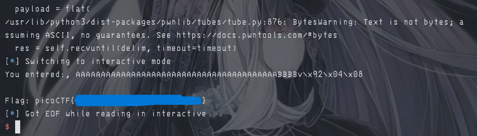

# 『Echo Escape 2』



# 『The challenge』

This challenge looks interesting and the security of this file is:



## 『Highlight vulnerability and parts of interesting』

source code:

```c
#include <stdio.h>
#include <stdlib.h>
#include <string.h>

void win() {
    FILE *fp = fopen("flag.txt", "r");
    if (!fp) {
        perror("[!] Could not open flag.txt");
        exit(1);
    }

    char flag[128];
    fgets(flag, sizeof(flag), fp);
    printf("Flag: %s\n", flag);
    fflush(stdout);
    fclose(fp);
}

void vuln() {
    char buf[32];  

    printf("Enter the secret key: ");
    fflush(stdout);

    fgets(buf, 128, stdin);

    printf("You entered:, %s\n", buf);
}

int main() {
    vuln();
    puts("Goodbye!");
    return 0;
}

```

almost same as echo escape 1 but the different is syntax to input user. You can read fgets behaviour in here https://devdocs.io/c/io/fgets (actually this is all c documentation). It will read all of input user until newline. It getting worse that it can read until 128 bytes and from this one, you can buffer overflow it and gain win function to direct it.

## 『Solving Challenge』
> solve by Lylera

So after knowing this one and this one same as `Echo Escape 1` but this file is 32 bit and using fgets to input. But still same

[solver.py](./source/solver.py)

You can read by yourself and understand it. Also i make 2 option, either you can make automatic search or just manual one. Two of these are fine as long you understand what it do.

### 『Flag』

the result:



### 『other』

- [chall](./source/)
- [solver.py](./source/solver.py)
- [Echo Escape 1](../Echo%20Escape%201/)