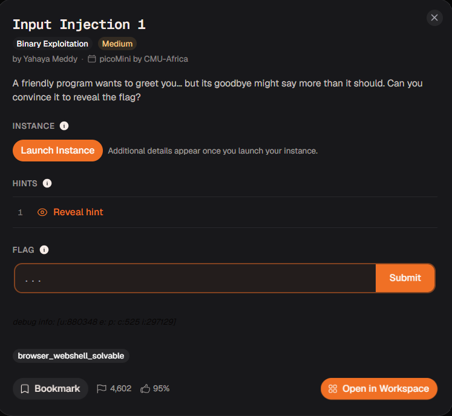
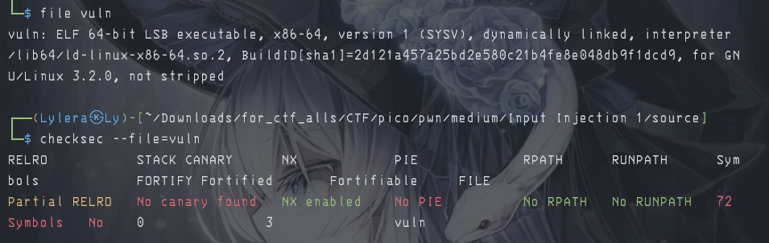

# 『Input Injection 1』



# 『The challenge』

This challenge looks interesting and the security of this file is:



To get this file, `launch an instance` first

## 『Highlight vulnerability and parts of interesting』

source code:

```c
#include <string.h>
#include <stdio.h>
#include <stdlib.h> 

void fun(char *name, char *cmd);

int main() {
    char name[200];
    printf("What is your name?\n");
    fflush(stdout);


    fgets(name, sizeof(name), stdin);
    name[strcspn(name, "\n")] = 0;

    fun(name, "uname");
    return 0;
}

void fun(char *name, char *cmd) {
    char c[10];
    char buffer[10];

    strcpy(c, cmd);
    strcpy(buffer, name);

    printf("Goodbye, %s!\n", buffer);
    fflush(stdout);
    system(c);
}

```

This challenge is buffer overflow and command injection. Basically it will call `fun` function and there is buffer with maximum 10 that you can overflow it and do some command like `ls` or `id`.

## 『Solving Challenge』
> solve by Lylera

Make simple, buffer till 10 bytes and after that you can whatever command shell you want.

[solver.py](./source/solver.py)

### 『Flag』

the result:


### 『other』

- [chall](./source/)
- [solver.py](./source/solver.py)