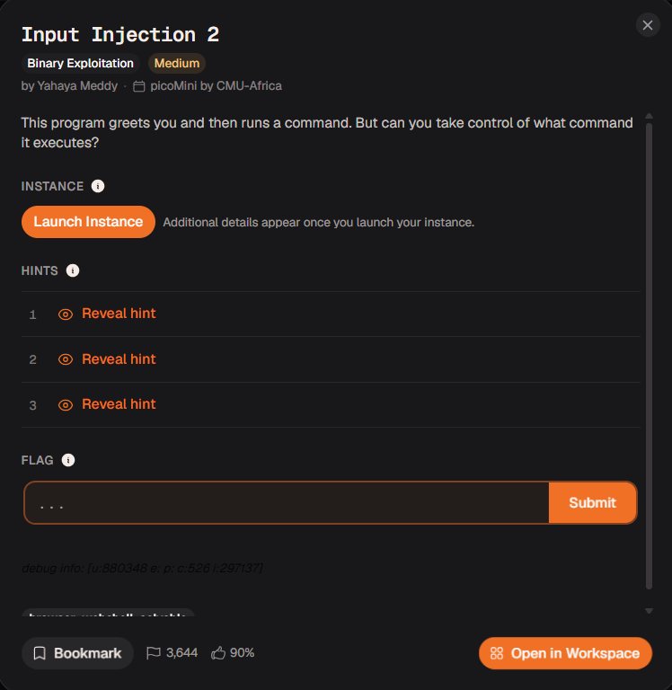
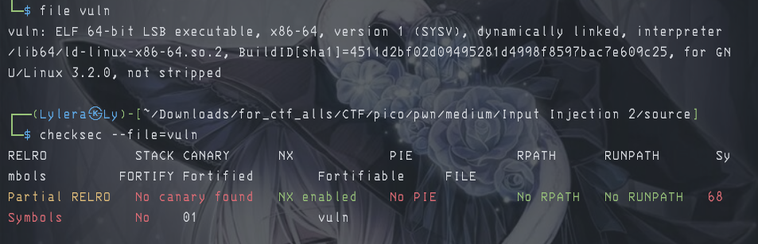
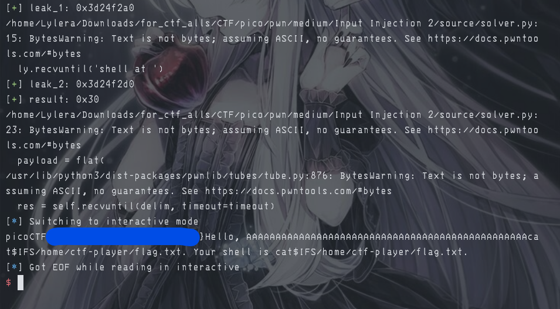

# 『Input Injection 2』



# 『The challenge』

This challenge looks interesting and the security of this file is:



## 『Highlight vulnerability and parts of interesting』

source code:

```c
#include <stdio.h>
#include <stdlib.h>
#include <string.h>


int main(void) {
	char* username = malloc(28);
	char* shell = malloc(28);
	
	printf("username at %p\n", username);
    fflush(stdout);
	printf("shell at %p\n", shell);
    fflush(stdout);
	
	strcpy(shell, "/bin/pwd");
	
	printf("Enter username: ");
    fflush(stdout);
	scanf("%s", username);
	
	printf("Hello, %s. Your shell is %s.\n", username, shell);
	system(shell);
    fflush(stdout);
	
	return 0;
}

```

Almost same as the first one (input injection 1), so in this one using `malloc` as save your input. But malloc itself is uninitialized. You can read at [malloc documentation](https://devdocs.io/c/memory/malloc) to understand how malloc behaving. On the code itself, it leak the memory address so you can use them for this advantage

## 『Solving Challenge』
> solve by Lylera

Because the memory address of username and shell itself get leak and use `malloc` to be storage (uninitialized) so here the script:

[solver.py](./source/solver.py)

You can read it in there

### 『Flag』

the result:



### 『other』

- [chall](./source/)
- [solver.py](./source/solver.py)
- [malloc documentation](https://devdocs.io/c/memory/malloc)

There are plenty interesting for this one:

- [stack overflow - 1](https://stackoverflow.com/questions/5213356/malloc-how-much-memory-has-been-allocated)
- [stack overflow - 2](https://stackoverflow.com/questions/17687182/confused-with-accessing-malloc-memory-uninitialized)